<p align="center">

</p>

[](https://raw.githubusercontent.com/poppopjmp/spiderfoot/master/LICENSE)
[](https://www.python.org)
[](VERSION)
[](docker-compose-microservices.yml)
[](spiderfoot/api/graphql/)
[](https://github.com/poppopjmp/spiderfoot/actions?query=workflow%3A"Tests")
[](https://codecov.io/github/poppopjmp/spiderfoot)
[](https://discord.gg/vyvztrG)

# SpiderFoot — OSINT Automation Platform

SpiderFoot is an open-source intelligence (OSINT) automation platform. It integrates with **300+ data sources** to gather intelligence on IP addresses, domain names, hostnames, network subnets, ASNs, email addresses, phone numbers, usernames, Bitcoin addresses, and more. Written in **Python 3** and **MIT-licensed**.

---

## Table of Contents

- [Architecture](#architecture)
- [Quick Start](#quick-start)
- [Deployment Modes](#deployment-modes)
- [Services](#services)
- [Security Hardening](#security-hardening)
- [CLI (Go)](#cli-go)
- [Monitoring & Observability](#monitoring--observability)
- [Active Scan Worker](#active-scan-worker)
- [Scan Profiles](#scan-profiles)
- [AI Agents](#ai-agents)
- [Document Enrichment](#document-enrichment)
- [User-Defined Input](#user-defined-input)
- [LLM Gateway](#llm-gateway)
- [GraphQL API](#graphql-api)
- [REST API](#rest-api)
- [Vector Search (Qdrant)](#vector-search-qdrant)
- [Object Storage (MinIO)](#object-storage-minio)
- [Configuration](#configuration)
- [Documentation](#documentation)
- [Modules](#modules)
- [Correlation Engine](#correlation-engine)
- [Web UI](#web-ui)
- [Frontend Testing](#frontend-testing)
- [Use Cases](#use-cases)
- [Development](#development)
- [Community](#community)

---

## Architecture

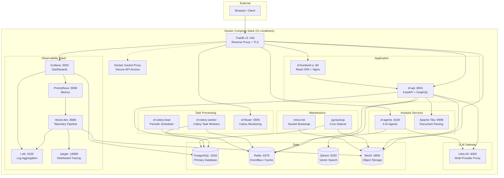

---

## Quick Start

### Option 1 — Docker Compose (Recommended)

```bash
git clone https://github.com/poppopjmp/spiderfoot.git
cd spiderfoot

# Copy and configure environment
cp .env.example .env
# Edit .env — change passwords, uncomment profile sections as needed

# Core only (5 services: postgres, redis, api, worker, frontend)
docker compose -f docker-compose-microservices.yml up --build -d

# Full stack (all services except SSO)
docker compose -f docker-compose-microservices.yml --profile full up --build -d
```

**Core (no profile)** — `http://localhost:3000`:

| URL | Service |
|-----|--------|
| `http://localhost:3000` | React SPA |
| `http://localhost:3000/api/docs` | Swagger / OpenAPI |

**Full stack (`--profile full`)** — `https://localhost` via Traefik:

| URL | Service |
|-----|--------|
| `https://localhost` | React SPA (via Traefik) |
| `https://localhost/api/docs` | Swagger / OpenAPI |
| `https://localhost/api/graphql` | GraphiQL IDE |
| `https://localhost/grafana/` | Grafana Dashboards |
| `https://localhost/flower/` | Celery Flower Monitoring |
| `https://localhost/minio/` | MinIO Console |
| `https://localhost/traefik/` | Traefik Dashboard |

### Option 2 — Standalone (Monolith)

```bash
pip install -r requirements.txt
python3 sf.py -l 127.0.0.1:5001
```

---

## Docker Compose Profiles

Services are organized into **profiles** — activate only what you need:

| Profile | Services | Description |
|---------|----------|-------------|
| *(core)* | postgres, redis, api, celery-worker, frontend | Always starts — minimal working set |
| `scan` | celery-worker-active | Active recon tools (nmap, nuclei, httpx, …) |
| `proxy` | traefik, docker-socket-proxy | Reverse proxy + TLS termination |
| `storage` | minio, minio-init, qdrant, tika, pg-backup | Object storage, vector DB, document parsing |
| `monitor` | vector, loki, grafana, prometheus, jaeger | Full observability stack |
| `ai` | agents, litellm | AI analysis agents + LLM gateway |
| `scheduler` | celery-beat, flower | Periodic tasks + Celery monitoring |
| `sso` | keycloak | OIDC / SAML identity provider |
| `full` | *all of the above except SSO* | Complete deployment |

```bash
# Mix and match profiles
docker compose -f docker-compose-microservices.yml --profile proxy --profile storage up -d

# Full stack + SSO
docker compose -f docker-compose-microservices.yml --profile full --profile sso up -d
```

---

## Deployment Modes

| Mode | Command | Description |
|------|---------|-------------|
| **Monolith** | `python3 sf.py -l 0.0.0.0:5001` | Single process, SQLite, zero dependencies |
| **Docker Core** | `docker compose -f docker-compose-microservices.yml up -d` | 5 core services (PostgreSQL, Redis, API, Worker, Frontend) |
| **Docker Full** | `docker compose -f docker-compose-microservices.yml --profile full up -d` | 21+ services with observability, AI, and storage |
| **Kubernetes** | `helm install sf helm/` | Horizontal scaling with Helm chart |

---

## Services

The Docker Compose deployment uses two networks (`sf-frontend`, `sf-backend`) and organizes services by profile:

### Core Services (always running)

| Service | Image | Port | Purpose |
|---------|-------|------|---------|
| **sf-postgres** | postgres:15-alpine | 5432 | Primary relational data store |
| **sf-redis** | redis:7-alpine | 6379 | EventBus pub/sub, caching, Celery broker |
| **sf-api** | spiderfoot-micro | 8001 | FastAPI REST + GraphQL API, scan orchestration |
| **sf-celery-worker** | spiderfoot-micro | — | Celery distributed task workers |
| **sf-frontend-ui** | spiderfoot-frontend | 3000 | React SPA served by Nginx |

### Profile Services

| Service | Profile | Image | Port | Purpose |
|---------|---------|-------|------|---------|
| **sf-celery-worker-active** | `scan` | spiderfoot-active | — | Active scanning (33+ recon tools) |
| **sf-traefik** | `proxy` | traefik:v3 | 443 | Reverse proxy, auto-TLS, routing |
| **sf-docker-proxy** | `proxy` | tecnativa/docker-socket-proxy | — | Secure Docker API access |
| **sf-minio** | `storage` | minio/minio | 9000 | S3-compatible object storage |
| **sf-minio-init** | `storage` | minio/mc | — | One-shot bucket creation |
| **sf-qdrant** | `storage` | qdrant/qdrant | 6333 | Vector similarity search |
| **sf-tika** | `storage` | apache/tika | 9998 | Document parsing (PDF, DOCX, etc.) |
| **sf-pg-backup** | `storage` | postgres:15-alpine | — | Cron sidecar: pg_dump → MinIO |
| **sf-vector** | `monitor` | timberio/vector | 8686 | Telemetry pipeline |
| **sf-loki** | `monitor` | grafana/loki | 3100 | Log aggregation |
| **sf-grafana** | `monitor` | grafana/grafana | 3000 | Dashboards & alerting |
| **sf-prometheus** | `monitor` | prom/prometheus | 9090 | Metrics collection |
| **sf-jaeger** | `monitor` | jaegertracing/jaeger | 16686 | Distributed tracing |
| **sf-agents** | `ai` | spiderfoot-micro | 8100 | 6 AI-powered analysis agents |
| **sf-litellm** | `ai` | ghcr.io/berriai/litellm | 4000 | Unified LLM proxy |
| **sf-celery-beat** | `scheduler` | spiderfoot-micro | — | Periodic task scheduler |
| **sf-flower** | `scheduler` | spiderfoot-micro | 5555 | Celery monitoring dashboard |
| **sf-keycloak** | `sso` | keycloak | 9080 | OIDC / SAML identity provider |

### Docker Volumes

| Volume | Mounted By | Purpose |
|--------|-----------|---------|
| `postgres-data` | sf-postgres | Database files |
| `redis-data` | sf-redis | RDB/AOF persistence |
| `qdrant-data` | sf-qdrant | Vector index storage |
| `minio-data` | sf-minio | Object storage files |
| `vector-data` | sf-vector | Buffer / checkpoints |
| `grafana-data` | sf-grafana | Dashboard state |
| `prometheus-data` | sf-prometheus | Metrics TSDB |
| `traefik-logs` | sf-traefik | Access logs |

### MinIO Buckets

| Bucket | Contents |
|--------|----------|
| `sf-logs` | Vector.dev log archive |
| `sf-reports` | Generated scan reports (HTML, PDF, JSON, CSV) |
| `sf-pg-backups` | PostgreSQL daily pg_dump files |
| `sf-qdrant-snapshots` | Qdrant vector DB snapshots |
| `sf-data` | General application artefacts |
| `sf-loki-data` | Loki chunk/index storage |
| `sf-loki-ruler` | Loki ruler data |

---

## Security Hardening

SpiderFoot v6.0.0 includes a comprehensive security hardening initiative (80+ commits, 9.5+ composite score):

### Authentication & Authorization

- **JWT authentication** on all 38+ API routers with `Depends(require_auth)`
- **WebSocket & SSE** auth validation — token verified before upgrade
- **CSP / X-Frame-Options / X-Content-Type-Options** headers via FastAPI middleware
- **SSO callback URL** origin validation (block open-redirect)
- **CORS** restricted to explicit allowed origins

### Input Validation & Injection Prevention

- **DOMPurify** sanitization on every API response rendered in the UI
- **SQL parameterization** audit across all database queries
- **Jinja2 SandboxedEnvironment** replacing native `Template`
- **SafeId** validation for all user-supplied identifiers (UUID format)
- **API error responses** scrubbed of internal stack traces and system paths

### Docker Hardening

- 13/23 services hardened with `security_opt: [no-new-privileges:true]`
- `read_only: true` + `tmpfs` mounts for ephemeral writes
- `cap_drop: [ALL]` with minimal `cap_add` where required
- Docker Socket Proxy limits (`POST=0`, `NETWORKS=0`, `VOLUMES=0`)

### Frontend Security

- **AbortSignal** on all 84+ API methods (cancel on unmount)
- **XSS-safe MarkdownRenderer** with DOMPurify + `marked`
- **Code splitting** — 10/12 pages lazy-loaded (reduced initial bundle)
- **Content Security Policy** enforced at Nginx and API level

---

## CLI (Go)

SpiderFoot ships with a **cross-platform Go CLI** (`cli/`) that compiles to a single static binary for Linux, macOS, and Windows. Built with [Cobra](https://github.com/spf13/cobra) and [Viper](https://github.com/spf13/viper).

```bash
cd cli && go build -o sf .

# Health check
sf health --server http://localhost:8001

# Scan management
sf scan list
sf scan start --target example.com --name "Recon"
sf scan get <scan-id>
sf scan stop <scan-id>

# Export
sf export json <scan-id>
sf export stix <scan-id>

# Schedules
sf schedule list
sf schedule create --name "Daily" --target example.com --interval 24

# Modules
sf modules --filter passive -o json
```

Cross-compile for all platforms:

```bash
cd cli && make all
# Produces: build/sf-linux-amd64, sf-darwin-arm64, sf-windows-amd64.exe, ...
```

Configuration via flags, `SF_*` environment variables, or `~/.spiderfoot.yaml`. See [cli/README.md](cli/README.md) for full documentation.

---

## Monitoring & Observability

SpiderFoot includes a complete observability stack, with **Vector.dev** serving as the unified telemetry pipeline (replacing both Promtail and OpenTelemetry Collector).

| Component | Purpose | Access |
|-----------|---------|--------|
| **Grafana** | Dashboards, alerting, log/metric exploration | `http://localhost:3000` |
| **Loki** | Log aggregation (backed by MinIO S3 storage) | via Grafana |
| **Prometheus** | Metrics collection from all services | `http://localhost:9090` |
| **Jaeger** | Distributed tracing (OTLP via Vector.dev) | `http://localhost:16686` |
| **Vector.dev** | Log/metrics/traces pipeline | Internal |

### Pre-built Dashboard

A 12-panel Grafana dashboard is auto-provisioned with: Active Scans, Events Processed, High-Risk Findings, API Latency, LLM Token Usage, Event Rate, Risk Level distribution, Module Execution times, Service Logs, Error Rate, and Enrichment Pipeline metrics.

---

## Active Scan Worker

SpiderFoot includes a **dedicated active scan worker** — a separate Celery container that ships **33+ external reconnaissance tools** for comprehensive target assessment. The active worker handles all scan tasks on a dedicated `scan` queue, keeping general tasks isolated.

### Architecture

```
┌─────────────────────────────────────┐
│         Redis (broker)              │
└──────┬──────────────────┬───────────┘
       │                  │
       ▼                  ▼
┌──────────────┐   ┌───────────────────────┐
│ celery-worker│   │ celery-worker-active   │
│ (general)    │   │ (scanning)             │
│              │   │                        │
│ queues:      │   │ queue: scan            │
│ default,     │   │                        │
│ report,      │   │ 33+ recon tools:       │
│ export,      │   │ httpx, subfinder,      │
│ agents,      │   │ amass, gobuster, dnsx, │
│ monitor      │   │ naabu, masscan, katana,│
│              │   │ nikto, nuclei, nmap,   │
│              │   │ and 22 more...         │
└──────────────┘   └───────────────────────┘
```

### Tools Included

The active worker builds on top of the base image (which includes nmap, nuclei, testssl.sh, whatweb, dnstwist, CMSeeK, retire.js, trufflehog, wafw00f, nbtscan, onesixtyone, snallygaster) and adds:

| Category | Tools |
|----------|-------|
| **DNS & Subdomains** | httpx, subfinder, amass, dnsx, massdns, gobuster |
| **Web Crawling** | katana, gospider, hakrawler, gau, waybackurls |
| **Web Fuzzing** | ffuf, arjun |
| **Port Scanning** | naabu, masscan |
| **Vulnerability** | nikto, dalfox |
| **SSL/TLS** | tlsx, sslyze, sslscan |
| **Secrets/JS** | gitleaks, linkfinder |
| **Screenshots** | gowitness (with Chromium) |
| **Wordlists** | 8 curated SecLists + DNS resolvers |

### Build

```bash
# Build everything (base + active worker)
docker compose -f docker-compose-microservices.yml up --build -d

# Or build just the active worker
docker build -f Dockerfile.active-worker -t spiderfoot-active:latest .
```

See [Active Scan Worker Guide](documentation/active-scan-worker.md) for full details.

---

## Scan Profiles

SpiderFoot ships with **11 predefined scan profiles** for common use cases. Profiles control which modules are enabled, option overrides, and execution constraints.

| Profile | Description | Key Modules |
|---------|-------------|-------------|
| **quick-recon** | Fast passive scan, no API keys | Passive modules only |
| **full-footprint** | Comprehensive active footprinting | All non-Tor modules |
| **passive-only** | Zero direct target interaction | Strictly passive |
| **vuln-assessment** | Vulnerability & exposure focus | Vuln scanners, reputation |
| **tools-only** | All external recon tools | 36 tool modules (requires active worker) |
| **social-media** | Social media presence discovery | Social & secondary networks |
| **dark-web** | Tor hidden service search | Tor-enabled modules |
| **infrastructure** | DNS, ports, hosting, SSL mapping | DNS, infrastructure |
| **api-powered** | Premium API data sources only | API-key modules |
| **minimal** | Bare minimum for validation | DNS resolve, spider |
| **investigate** | Deep targeted investigation | Investigation modules |

### Tools-Only Profile

The `tools-only` profile runs **all 36 external tool modules** against a target — both pre-installed base tools (13 `sfp_tool_*` modules), active worker tools (20 `sfp_tool_*` modules), and the pre-existing tool integrations (`sfp_httpx`, `sfp_subfinder`, `sfp_nuclei`). It includes `sfp_dnsresolve` and `sfp_spider` as core helpers to feed discovered data into the tool pipeline.

```bash
# Start a tools-only scan via API
curl -X POST http://localhost/api/scans \
  -H "Content-Type: application/json" \
  -d '{"target": "example.com", "type": "DOMAIN_NAME", "profile": "tools-only"}'
```

Profiles are managed via `spiderfoot.scan.scan_profile.ProfileManager` — see [Developer Guide](documentation/developer_guide.md).

---

## AI Agents

Six LLM-powered agents automatically analyze high-risk findings and produce structured intelligence. They subscribe to Redis event bus topics and process events asynchronously.

| Agent | Trigger Events | Output |
|-------|---------------|--------|
| **FindingValidator** | `MALICIOUS_*`, `VULNERABILITY_*` | Verdict (confirmed/likely_false_positive), confidence, remediation |
| **CredentialAnalyzer** | `LEAKED_CREDENTIALS`, `API_KEY_*` | Severity, active status, affected services |
| **TextSummarizer** | `RAW_*`, `TARGET_WEB_CONTENT` | Summary, entities, sentiment, relevance score |
| **ReportGenerator** | `SCAN_COMPLETE` | Executive summary, threat assessment, recommendations |
| **DocumentAnalyzer** | `DOCUMENT_UPLOAD`, `USER_DOCUMENT` | Entities, IOCs, classification, scan targets |
| **ThreatIntelAnalyzer** | `MALICIOUS_*`, `CVE_*`, `DARKNET_*` | MITRE ATT&CK mapping, threat actor attribution |

API: `http://localhost/agents/` — see [Architecture Guide](documentation/ARCHITECTURE.md) for endpoints.

---

## Document Enrichment

Upload documents (PDF, DOCX, XLSX, HTML, RTF, plain text) for automated entity and IOC extraction.

### Pipeline

1. **Convert** — Document → plain text (pypdf, python-docx, openpyxl, etc.)
2. **Extract** — Regex-based entity extraction (IPs, domains, hashes, CVEs, crypto addresses, etc.)
3. **Store** — Original + extracted content → MinIO `sf-enrichment` bucket
4. **Analyze** — Forward to DocumentAnalyzer agent for LLM-powered intelligence

API: `POST http://localhost/enrichment/upload` (100MB limit)

---

## User-Defined Input

Supply your own documents, IOCs, reports, and context to augment automated OSINT collection.

| Endpoint | Description |
|----------|-------------|
| `POST /input/document` | Upload document → enrichment → agent analysis |
| `POST /input/iocs` | Submit IOC list (IPs, domains, hashes) with dedup |
| `POST /input/report` | Structured report → entity extraction → analysis |
| `POST /input/context` | Set scope, exclusions, threat model for a scan |
| `POST /input/targets` | Batch target list for multi-scan |

---

## LLM Gateway

[LiteLLM](https://litellm.ai/) provides a unified OpenAI-compatible API for all LLM interactions, supporting OpenAI, Anthropic, and self-hosted Ollama models.

| Alias | Model | Use Case |
|-------|-------|----------|
| `default` | gpt-4o-mini | Most agent tasks |
| `fast` | gpt-3.5-turbo | Low-cost, fast tasks |
| `smart` | gpt-4o | Complex reports & threat intel |
| `local` | ollama/llama3 | Self-hosted, no API key |

Configure API keys in `.env` — see `docker/env.example` for all options.

---

## GraphQL API

The GraphQL API is served by [Strawberry](https://strawberry.rocks/) at `/api/graphql` with a built-in GraphiQL IDE. It supports **queries**, **mutations**, and real-time **subscriptions** via WebSocket.

### Queries

| Field | Description |
|-------|-------------|
| `scan(scanId)` | Fetch a single scan by ID |
| `scans(pagination, statusFilter)` | Paginated scan listing |
| `scanEvents(scanId, filter, pagination)` | Filtered & paginated events |
| `eventSummary(scanId)` | Aggregated event type counts |
| `scanCorrelations(scanId)` | Correlation findings for a scan |
| `scanLogs(scanId, logType, limit)` | Scan execution logs |
| `scanStatistics(scanId)` | Dashboard-ready aggregate stats |
| `scanGraph(scanId, maxNodes)` | Event relationship graph for visualization |
| `eventTypes` | All available event type definitions |
| `workspaces` | List workspaces |
| `searchEvents(query, scanIds, eventTypes)` | Cross-scan text search |
| `semanticSearch(query, collection, limit, scoreThreshold, scanId)` | Qdrant vector similarity search |
| `vectorCollections` | List Qdrant collections and stats |

### Mutations

| Mutation | Description |
|----------|-------------|
| `startScan(input: ScanCreateInput!)` | Create and start a new OSINT scan |
| `stopScan(scanId!)` | Abort a running scan |
| `deleteScan(scanId!)` | Delete a scan and all related data |
| `setFalsePositive(input: FalsePositiveInput!)` | Mark/unmark results as false positive |
| `rerunScan(scanId!)` | Clone and restart a completed scan |

### Subscriptions (WebSocket)

| Subscription | Description |
|--------------|-------------|
| `scanProgress(scanId, interval)` | Real-time scan status changes |
| `scanEventsLive(scanId, interval)` | Stream new events as they are discovered |

Connect via `ws://localhost/api/graphql` using the `graphql-transport-ws` protocol.

### Example Queries

```graphql
# Fetch scan with dashboard statistics
query {
  scan(scanId: "abc-123") {
    name
    target
    status
    durationSeconds
    isRunning
  }
  scanStatistics(scanId: "abc-123") {
    totalEvents
    uniqueEventTypes
    totalCorrelations
    riskDistribution { level count percentage }
    topModules { module count }
  }
}

# Semantic vector search across OSINT events
query {
  semanticSearch(query: "phishing domain", limit: 10, scoreThreshold: 0.7) {
    hits { id score eventType data scanId risk }
    totalFound
    queryTimeMs
  }
}

# Start a new scan
mutation {
  startScan(input: { name: "Recon scan", target: "example.com" }) {
    success
    message
    scanId
    scan { status }
  }
}

# Subscribe to live scan progress
subscription {
  scanProgress(scanId: "abc-123") {
    status
    durationSeconds
    isRunning
  }
}
```

---

## REST API

Full OpenAPI / Swagger documentation is available at `/api/docs` when the API service is running.

### Key Endpoints

| Method | Endpoint | Description |
|--------|----------|-------------|
| `GET` | `/api/scans` | List all scans |
| `POST` | `/api/scans` | Create and start a new scan |
| `GET` | `/api/scans/{id}` | Get scan details |
| `POST` | `/api/scans/{id}/stop` | Stop a running scan |
| `DELETE` | `/api/scans/{id}` | Delete a scan |
| `GET` | `/api/scans/{id}/results` | Scan result events |
| `GET` | `/api/scans/{id}/correlations` | Correlation findings |
| `GET` | `/api/scans/{id}/export/{format}` | Export (CSV/JSON/STIX/SARIF) |
| `GET` | `/api/health` | Service health check |
| `GET` | `/api/modules` | List available modules |
| `GET` | `/api/storage/buckets` | List MinIO buckets |

### Example

```bash
# Start a scan
curl -X POST http://localhost/api/scans \
  -H "Content-Type: application/json" \
  -d '{"target": "example.com", "type": "DOMAIN_NAME", "modules": ["sfp_dnsresolve"]}'

# Get scan results
curl http://localhost/api/scans/{scan_id}/results
```

---

## Vector Search (Qdrant)

SpiderFoot uses [Qdrant](https://qdrant.tech/) for semantic vector search and OSINT event correlation.

### How It Works

1. **Embedding** — Scan events are embedded into 384-dimensional vectors using `all-MiniLM-L6-v2` (configurable).
2. **Indexing** — Vectors are stored in Qdrant collections prefixed with `sf_`.
3. **Search** — Natural language queries are embedded and matched against stored events using cosine similarity.
4. **Correlation** — The Vector Correlation Engine supports 5 strategies: `SIMILARITY`, `CROSS_SCAN`, `TEMPORAL`, `INFRASTRUCTURE`, `MULTI_HOP`.

### Configuration

| Environment Variable | Default | Description |
|---------------------|---------|-------------|
| `SF_QDRANT_HOST` | `sf-qdrant` | Qdrant server hostname |
| `SF_QDRANT_PORT` | `6333` | Qdrant REST API port |
| `SF_QDRANT_PREFIX` | `sf_` | Collection name prefix |
| `SF_EMBEDDING_PROVIDER` | `mock` | `mock`, `sentence_transformer`, `openai`, `huggingface` |
| `SF_EMBEDDING_MODEL` | `all-MiniLM-L6-v2` | Embedding model name |
| `SF_EMBEDDING_DIMENSIONS` | `384` | Vector dimensionality |

---

## Object Storage (MinIO)

[MinIO](https://min.io/) provides S3-compatible object storage for logs, reports, backups, and vector snapshots.

### Storage API

| Method | Endpoint | Description |
|--------|----------|-------------|
| `GET` | `/api/storage/buckets` | List all buckets |
| `GET` | `/api/storage/buckets/{name}` | List objects in a bucket |
| `GET` | `/api/storage/buckets/{name}/{key}` | Download an object |
| `POST` | `/api/storage/buckets/{name}` | Upload an object |
| `DELETE` | `/api/storage/buckets/{name}/{key}` | Delete an object |

### Configuration

| Environment Variable | Default | Description |
|---------------------|---------|-------------|
| `SF_MINIO_ENDPOINT` | `sf-minio:9000` | MinIO server |
| `SF_MINIO_ACCESS_KEY` | `minioadmin` | Access key |
| `SF_MINIO_SECRET_KEY` | `minioadmin` | Secret key |
| `SF_MINIO_SECURE` | `false` | Use TLS |

---

## Configuration

All services are configured via environment variables (see `docker/env.example`):

| Variable | Purpose | Default |
|----------|---------|---------|
| `SF_DEPLOYMENT_MODE` | `monolith` or `microservices` | `monolith` |
| `SF_DATABASE_URL` | PostgreSQL connection string | SQLite |
| `SF_REDIS_URL` | Redis URL for EventBus/Cache | None |
| `SF_EVENTBUS_BACKEND` | `memory`, `redis`, or `nats` | `memory` |
| `SF_VECTOR_ENDPOINT` | Vector.dev HTTP endpoint | None |
| `SF_LOG_FORMAT` | `json` or `text` | `text` |
| `SF_QDRANT_HOST` | Qdrant hostname | `sf-qdrant` |
| `SF_MINIO_ENDPOINT` | MinIO endpoint | `sf-minio:9000` |
| `SF_EMBEDDING_PROVIDER` | Embedding backend | `mock` |
| `SF_LLM_API_BASE` | LiteLLM proxy URL | `http://litellm:4000` |
| `SF_LLM_DEFAULT_MODEL` | Default LLM model | `default` |
| `OPENAI_API_KEY` | OpenAI API key (for LiteLLM) | None |
| `ANTHROPIC_API_KEY` | Anthropic API key (for LiteLLM) | None |
| `OLLAMA_API_BASE` | Ollama server URL | `http://host.docker.internal:11434` |
| `OTEL_ENDPOINT` | OTLP endpoint for tracing | `http://vector:4317` |
| `GF_SECURITY_ADMIN_PASSWORD` | Grafana admin password | `spiderfoot` |

---

## Documentation

| Document | Description |
|----------|-------------|
| [Installation Guide](documentation/installation.md) | System requirements and setup |
| [Quick Start](documentation/quickstart.md) | Get scanning in minutes |
| [User Guide](documentation/user_guide.md) | Core concepts and usage |
| [API Reference](documentation/api_reference.md) | REST + GraphQL API docs |
| [Architecture Guide](documentation/ARCHITECTURE.md) | Microservices design |
| [Docker Deployment](documentation/docker_deployment.md) | Container deployment guide |
| [Module Guide](documentation/modules.md) | Understanding and writing modules |
| [Module Migration](documentation/MODULE_MIGRATION_GUIDE.md) | Migrating to ModernPlugin |
| [Active Scan Worker](documentation/active-scan-worker.md) | 33+ external tool integration |
| [Correlation Rules](correlations/README.md) | YAML correlation engine reference |
| [Security Guide](documentation/security.md) | Authentication, hardening, audit |
| [Developer Guide](documentation/developer_guide.md) | Contributing and code structure |
| [FAQ](documentation/faq.md) | Frequently asked questions |
| [Troubleshooting](documentation/troubleshooting.md) | Common issues and solutions |

---

## Modules

SpiderFoot has **300+ modules**, most of which do not require API keys. Modules feed each other in a publisher/subscriber model for maximum data extraction.

### Module Categories

| Category | Examples | Count |
|----------|----------|-------|
| **DNS & Infrastructure** | DNS resolver, zone transfer, brute-force | ~20 |
| **Social Media** | Twitter, Instagram, Reddit, Telegram, TikTok | ~15 |
| **Threat Intelligence** | Shodan, VirusTotal, AlienVault, GreyNoise | ~30 |
| **Search Engines** | Google, Bing, DuckDuckGo, Baidu | ~10 |
| **Data Breaches** | HaveIBeenPwned, LeakCheck, Dehashed, Hudson Rock | ~11 |
| **Crypto & Blockchain** | Bitcoin, Ethereum, Tron, BNB | ~8 |
| **Reputation / Blacklists** | Spamhaus, SURBL, PhishTank, DNSBL | ~30 |
| **Internal Analysis** | Extractors, validators, identifiers | ~25 |
| **External Tools** | 36 tools: httpx, amass, nmap, nuclei, nikto, gobuster, etc. | ~36 |
| **Cloud Storage** | S3, Azure Blob, Google Cloud, DigitalOcean | ~5 |

For the full module list, see [documentation/modules.md](documentation/modules.md).

---

## Correlation Engine

SpiderFoot includes a YAML-configurable rule engine with **94 pre-defined correlation rules**.

```bash
# View all rules
ls correlations/*.yaml

# Template for writing new rules
cat correlations/template.yaml
```

Rule categories: vulnerability severity, exposure detection, cross-scan outliers, stale hosts, infrastructure analysis, blockchain risk aggregation.

See [correlations/README.md](correlations/README.md) for the full reference.

---

## Web UI

SpiderFoot ships with a modern **React SPA** built with TypeScript, Vite, and Tailwind CSS. The UI features a dark theme with cyan accents, responsive layout, and real-time scan updates via WebSocket subscriptions.

### Login

Secure JWT-based authentication with SSO support (OIDC/SAML).

<p align="center">
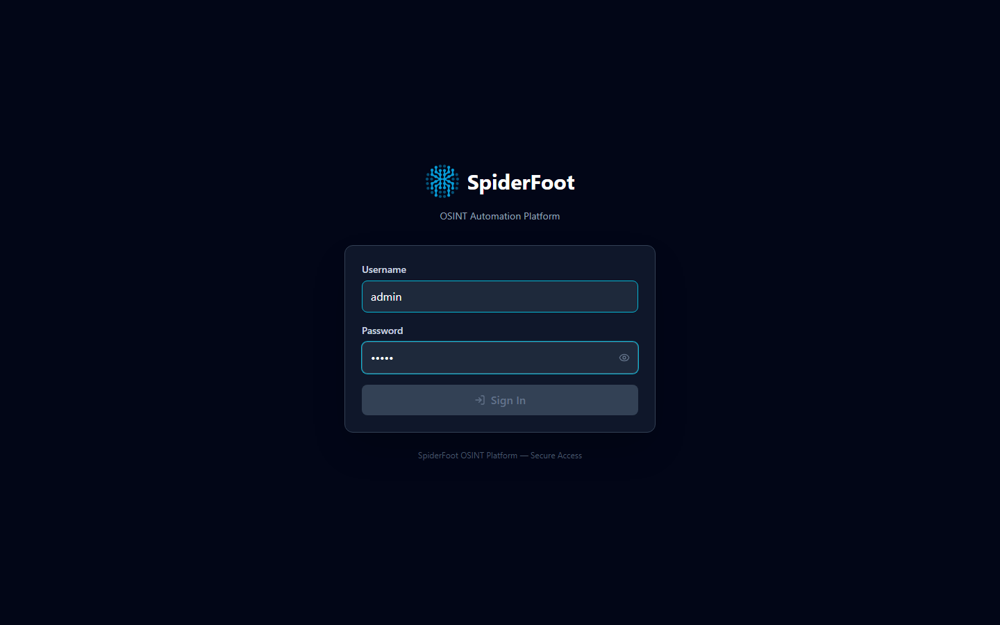
</p>

### Dashboard

The main dashboard provides at-a-glance statistics — active scans, total events, risk distribution, and recent activity.

<p align="center">

</p>

### New Scan

Configure and launch OSINT scans against domains, IPs, email addresses, usernames, and more. Select module categories, set scan options, and start with a single click.

<p align="center">
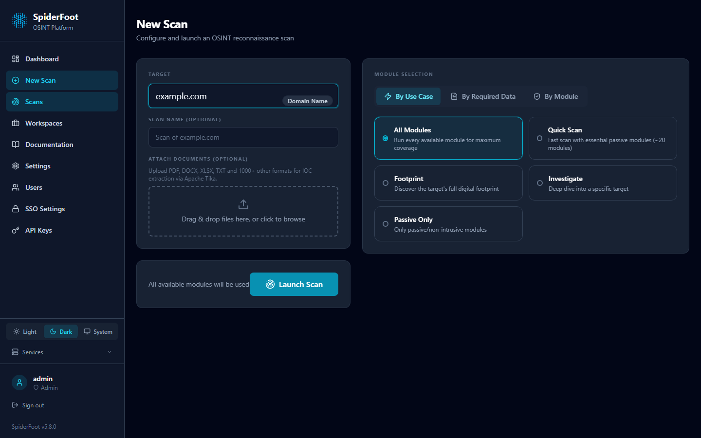
</p>

### Scans List

View all scans with status, target, event counts, and duration. Filter, search, and manage scans from one place.

<p align="center">
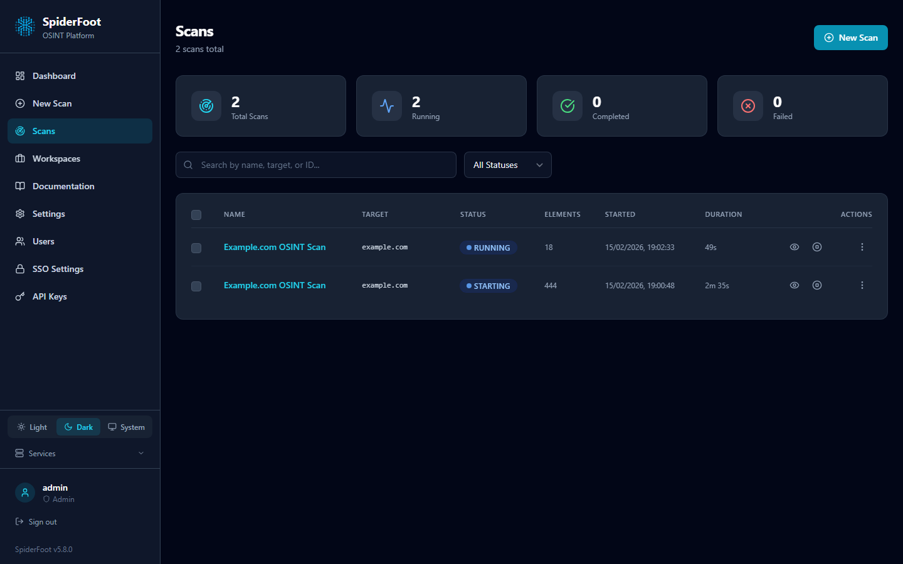
</p>

### Scan Detail — Summary

Each scan has a detailed view with tabbed navigation. The Summary tab shows key metrics, risk distribution, top modules, and event type breakdown.

<p align="center">

</p>

### Scan Detail — Browse

Browse all discovered data elements with filtering by event type, risk level, and source module. Expand rows to see full detail and provenance chain.

<p align="center">
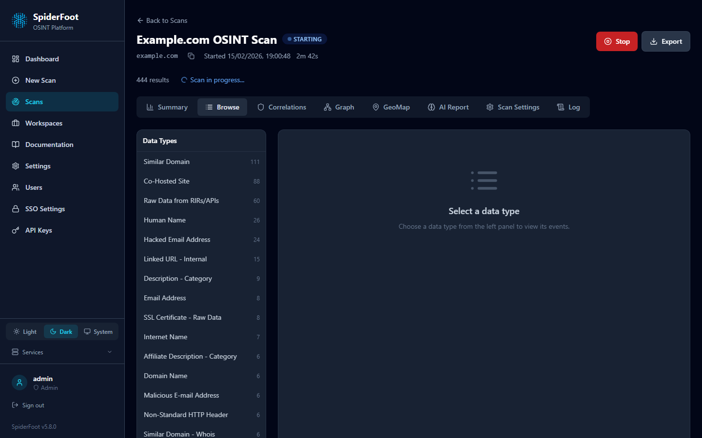
</p>

### Scan Detail — Graph

Interactive force-directed graph visualization of entity relationships. Explore how discovered domains, IPs, emails, and other entities connect to each other.

<p align="center">
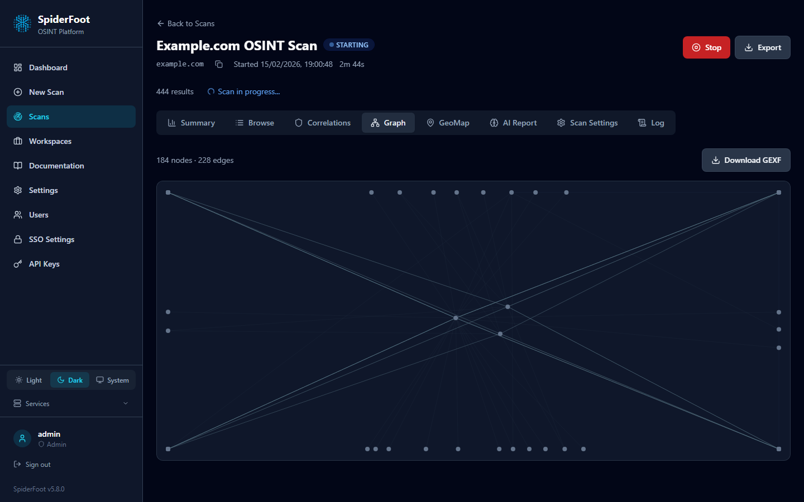
</p>

### Scan Detail — GeoMap

World map view plotting the geographic locations of discovered IP addresses, with country-level aggregation and risk coloring.

<p align="center">
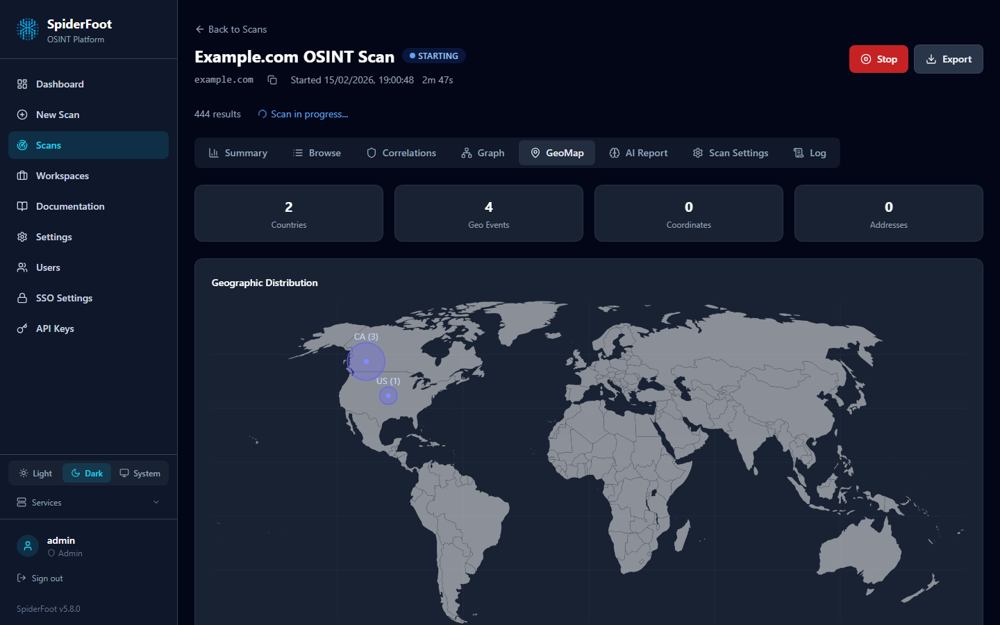
</p>

### Scan Detail — Correlations

Automated correlation findings from the YAML rule engine. Each finding includes severity, description, matched evidence, and remediation guidance.

<p align="center">
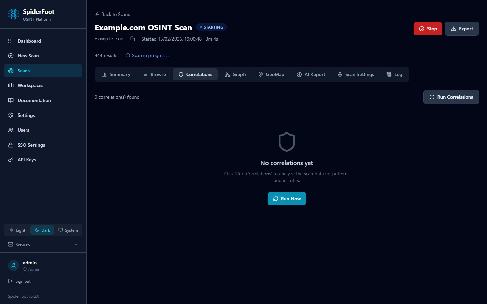
</p>

### Scan Detail — AI Report

LLM-generated Cyber Threat Intelligence (CTI) report with executive summary, key findings, risk assessment, recommendations, and technical details — produced by the AI report generator using scan data.

<p align="center">

</p>

### Workspaces

Organize scans into workspaces for multi-target campaigns. Each workspace groups related scans, tracks notes, and provides workspace-level analytics and AI-generated reports.

<p align="center">
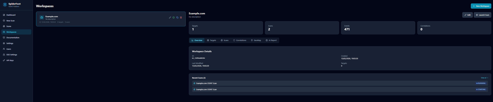
</p>

### Settings

Configure global application settings, module API keys, notification preferences, and scan defaults.

<p align="center">
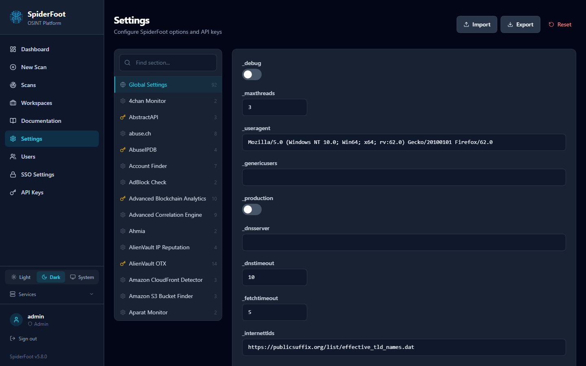
</p>

### Agents

Monitor and manage the 6 AI-powered analysis agents. View agent status, processed event counts, and recent analysis results.

<p align="center">
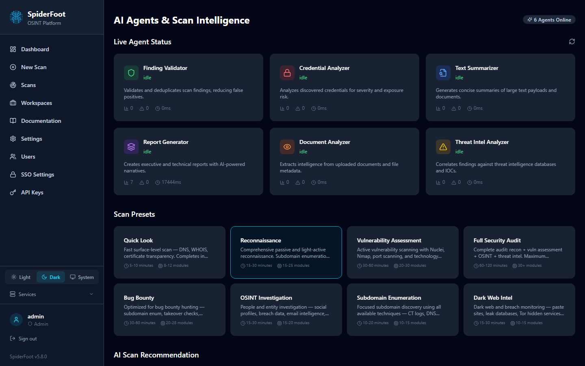
</p>

### Emotional Design Features

The UI applies **emotional design principles** for a richer developer experience:

- **Tooltip** — accessible, portal-based, viewport-clamped tooltips with `aria-describedby`
- **Real-time Progress** — SSE-powered scan progress bar with per-module breakdown
- **Celebration Banner** — animated success state when a scan completes
- **Notification Center** — bell icon with unread badge, notification panel (Zustand store, max 50 items)
- **Command Palette** — `Ctrl+K` / `⌘K` fuzzy search across pages and recent scans with keyboard navigation
- **Schedules Page** — full CRUD for recurring scan schedules (create, edit, toggle, delete, manual trigger)
- **STIX 2.1 Export** — one-click export of scan data as a STIX bundle

---

## Frontend Testing

The React frontend includes **282 tests** across 27 test files, powered by Vitest 3 and Testing Library:

| Suite | Tests | Coverage |
|-------|-------|----------|
| UI Components | 47 | Button, Badge, StatusBadge, ProgressBar, CardSkeleton, EmptyState, ConfirmDialog, Toast, Tabs, ModalShell, PageHeader, RiskPills |
| API Layer | 45 | All endpoint methods, error handling, auth headers, AbortSignal |
| Auth | 36 | Login, logout, token refresh, SSO flows, role guards |
| Login Page | 21 | Form validation, submission, SSO redirects, error states |
| Layout | 18 | Navigation items, sidebar, responsive, NotificationCenter, CommandPalette |
| Markdown Renderer | 16 + 14 | DOMPurify sanitization, XSS prevention, rendering |
| Emotional Design | 13 | Tooltip lifecycle, notification store CRUD, cap enforcement |
| Sanitize | 7 | DOMPurify integration, script stripping, attribute cleaning |
| ErrorBoundary | 8 | Crash recovery, fallback UI, error logging |
| Schedules | 4 | Page rendering, empty state, data display, create modal |
| Safe Storage | 4 | localStorage quota handling |
| Scan Tabs | 5 | GraphTab, BrowseTab, LogTab, GeoMapTab smoke tests |
| CommandPalette | 7 | Keyboard shortcuts, search, filtering, ARIA |

```bash
cd frontend && npx vitest run    # Run all tests
cd frontend && npx vitest --ui   # Interactive UI mode
```

---

## Use Cases

### Offensive Security (Red Team / Pen Test)

- Target reconnaissance and attack surface mapping
- Sub-domain discovery and hijack detection
- Credential exposure discovery
- Technology stack fingerprinting

### Defensive Security (Blue Team)

- Asset inventory and shadow IT detection
- Data breach monitoring
- Brand protection and phishing detection
- Threat intelligence enrichment

### Scan Targets

IP addresses · domains · subdomains · hostnames · CIDR subnets · ASNs · email addresses · phone numbers · usernames · person names · Bitcoin/Ethereum addresses

---

## Development

### Project Structure

```
spiderfoot/
├── api/                  # FastAPI application (38+ routers)
│   ├── graphql/          # Strawberry GraphQL (queries, mutations, subscriptions)
│   ├── routers/          # REST endpoint routers
│   ├── schemas.py        # Pydantic v2 contracts
│   └── versioning.py     # /api/v1/ prefix
├── agents/               # AI analysis agents (6 LLM-powered)
├── enrichment/           # Document enrichment pipeline
├── user_input/           # User-defined input ingestion
├── config/               # App configuration
├── db/                   # Database layer (repositories, migrations)
├── events/               # Event types, relay, dedup
├── plugins/              # Module loading and registry
├── security/             # Auth, CSRF, middleware
├── services/             # External integrations (embedding, cache, DNS)
├── observability/        # Logging, metrics, health, tracing
├── reporting/            # Report generation and export
├── cli/commands/         # Python CLI commands (25 commands)
└── vector_correlation.py # Vector correlation engine
cli/                      # Go CLI (cross-platform, Cobra-based)
├── cmd/                  # Commands: scan, modules, export, schedule, health, config
├── internal/client/      # HTTP client with auth, TLS
├── internal/output/      # Table, JSON, CSV formatters
├── Makefile              # Cross-compilation (6 targets)
└── go.mod                # Go module definition
frontend/                 # React SPA (TypeScript + Vite + Tailwind)
├── src/components/       # UI components (20+ primitives, Layout, NotificationCenter, CommandPalette)
├── src/pages/            # 14 pages (Dashboard, Scans, ScanDetail, Schedules, ...)
├── src/hooks/            # Custom hooks (useScanProgress SSE)
├── src/lib/              # API client, auth, notifications store
├── src/__tests__/        # 270 tests — Vitest + Testing Library
└── vite.config.ts        # Build config
infra/                    # Infrastructure configs
├── grafana/              # Dashboards + datasource provisioning
├── loki/                 # Loki local config (MinIO S3 backend)
├── litellm/              # LiteLLM model config
└── prometheus/           # Scrape targets config
modules/                  # 283 OSINT modules
correlations/             # 94 YAML correlation rules
documentation/            # Comprehensive docs
scripts/                  # Utility and maintenance scripts
docker/                   # Docker build files + nginx config
helm/                     # Kubernetes Helm chart
```

### Running Tests

```bash
# Backend tests
pip install -r requirements.txt
pytest --tb=short -q

# Frontend tests (282 tests, 27 files)
cd frontend && npx vitest run

# Go CLI tests
cd cli && go test ./...
```

### Version Management

```bash
cat VERSION                            # Check current version
python update_version.py --set 5.247.0 # Update all references
python update_version.py --check       # Validate consistency
```

---

## Community

Join the [Discord server](https://discord.gg/vyvztrG) for help, feature requests, or general OSINT discussion.

**Maintainer:** Poppopjmp <van1sh@van1shland.io>

---

## License

SpiderFoot is licensed under the [MIT License](LICENSE).

---

*Actively developed since 2012 — 300+ modules, 38+ API routers, 94 correlation rules, 21-service Docker deployment, Go CLI, 247 frontend tests, comprehensive security hardening (9.0+ score), AI agents, vector search, and full observability.*
