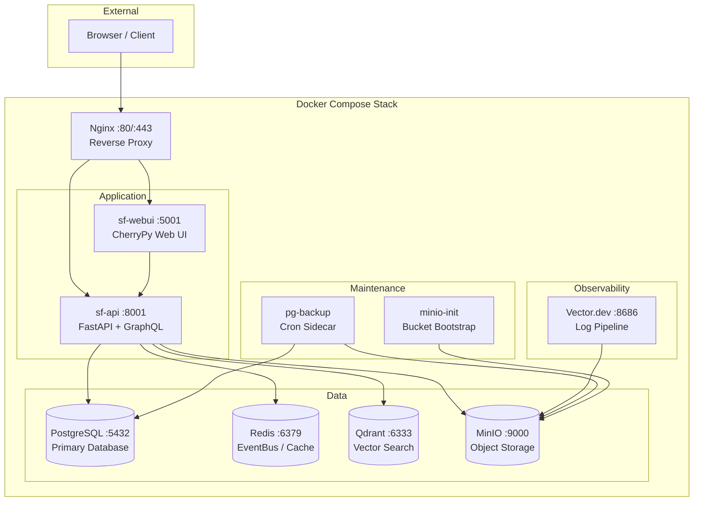

<p align="center">

</p>

[](https://raw.githubusercontent.com/poppopjmp/spiderfoot/master/LICENSE)
[](https://www.python.org)
[](VERSION)
[](docker-compose-microservices.yml)
[](spiderfoot/api/graphql/)
[](https://github.com/poppopjmp/spiderfoot/actions?query=workflow%3A"Tests")
[](https://codecov.io/github/poppopjmp/spiderfoot)
[](https://discord.gg/vyvztrG)

# SpiderFoot — OSINT Automation Platform

SpiderFoot is an open-source intelligence (OSINT) automation platform. It integrates with **200+ data sources** to gather intelligence on IP addresses, domain names, hostnames, network subnets, ASNs, email addresses, phone numbers, usernames, Bitcoin addresses, and more. Written in **Python 3** and **MIT-licensed**.

---

## Table of Contents

- [Architecture](#architecture)
- [Quick Start](#quick-start)
- [Deployment Modes](#deployment-modes)
- [Services](#services)
- [GraphQL API](#graphql-api)
- [REST API](#rest-api)
- [Vector Search (Qdrant)](#vector-search-qdrant)
- [Object Storage (MinIO)](#object-storage-minio)
- [Configuration](#configuration)
- [Documentation](#documentation)
- [Modules](#modules)
- [Correlation Engine](#correlation-engine)
- [Use Cases](#use-cases)
- [Development](#development)
- [Community](#community)

---

## Architecture



---

## Quick Start

### Option 1 — Docker Microservices (Recommended)

```bash
git clone https://github.com/poppopjmp/spiderfoot.git
cd spiderfoot

# Start the full 10-service stack
docker compose -f docker-compose-microservices.yml up --build -d
```

| URL | Service |
|-----|---------|
| `http://localhost` | Web UI (via Nginx) |
| `http://localhost/api/docs` | Swagger / OpenAPI |
| `http://localhost/api/graphql` | GraphiQL IDE |
| `http://localhost:9001` | MinIO Console |

### Option 2 — Standalone (Monolith)

```bash
pip install -r requirements.txt
python3 sf.py -l 127.0.0.1:5001
```

---

## Deployment Modes

| Mode | Command | Description |
|------|---------|-------------|
| **Monolith** | `python3 sf.py -l 0.0.0.0:5001` | Single process, SQLite, zero dependencies |
| **Docker Compose** | `docker compose -f docker-compose-microservices.yml up -d` | 10 services, PostgreSQL, Redis, Qdrant, MinIO |
| **Kubernetes** | `helm install sf helm/` | Horizontal scaling with Helm chart |

---

## Services

The microservices deployment runs **10 containers** on two Docker networks (`sf-frontend`, `sf-backend`):

| Service | Image | Port | Purpose |
|---------|-------|------|---------|
| **sf-nginx** | nginx:alpine | 80 / 443 | Reverse proxy, TLS termination, rate limiting |
| **sf-api** | spiderfoot | 8001 | FastAPI REST + GraphQL API, scan orchestration |
| **sf-webui** | spiderfoot | 5001 | CherryPy web UI, proxies all data through API |
| **sf-postgres** | postgres:16 | 5432 | Primary relational data store |
| **sf-redis** | redis:7-alpine | 6379 | EventBus pub/sub, caching, session store |
| **sf-qdrant** | qdrant/qdrant | 6333 | Vector similarity search for semantic OSINT correlation |
| **sf-minio** | minio/minio | 9000 / 9001 | S3-compatible object storage (logs, reports, backups) |
| **sf-vector** | timberio/vector | 8686 | Log pipeline — collects, transforms, ships logs to MinIO |
| **sf-pg-backup** | spiderfoot | — | Cron sidecar: pg_dump → MinIO (`sf-pg-backups` bucket) |
| **sf-minio-init** | minio/mc | — | One-shot: creates 5 MinIO buckets on first boot |

### Docker Volumes

| Volume | Mounted By | Purpose |
|--------|-----------|---------|
| `sf-postgres-data` | sf-postgres | Database files |
| `sf-redis-data` | sf-redis | RDB/AOF persistence |
| `sf-qdrant-data` | sf-qdrant | Vector index storage |
| `sf-minio-data` | sf-minio | Object storage files |
| `sf-vector-data` | sf-vector | Buffer / checkpoints |
| `sf-api-data` | sf-api | Application state |
| `sf-webui-data` | sf-webui | Session / cache |

### MinIO Buckets

| Bucket | Contents |
|--------|----------|
| `sf-logs` | Vector.dev log archive |
| `sf-reports` | Generated scan reports (HTML, PDF, JSON, CSV) |
| `sf-pg-backups` | PostgreSQL daily pg_dump files |
| `sf-qdrant` | Qdrant vector DB snapshots |
| `sf-data` | General application artefacts |

---

## GraphQL API

The GraphQL API is served by [Strawberry](https://strawberry.rocks/) at `/api/graphql` with a built-in GraphiQL IDE. It supports **queries**, **mutations**, and real-time **subscriptions** via WebSocket.

### Queries

| Field | Description |
|-------|-------------|
| `scan(scanId)` | Fetch a single scan by ID |
| `scans(pagination, statusFilter)` | Paginated scan listing |
| `scanEvents(scanId, filter, pagination)` | Filtered & paginated events |
| `eventSummary(scanId)` | Aggregated event type counts |
| `scanCorrelations(scanId)` | Correlation findings for a scan |
| `scanLogs(scanId, logType, limit)` | Scan execution logs |
| `scanStatistics(scanId)` | Dashboard-ready aggregate stats |
| `scanGraph(scanId, maxNodes)` | Event relationship graph for visualization |
| `eventTypes` | All available event type definitions |
| `workspaces` | List workspaces |
| `searchEvents(query, scanIds, eventTypes)` | Cross-scan text search |
| `semanticSearch(query, collection, limit, scoreThreshold, scanId)` | Qdrant vector similarity search |
| `vectorCollections` | List Qdrant collections and stats |

### Mutations

| Mutation | Description |
|----------|-------------|
| `startScan(input: ScanCreateInput!)` | Create and start a new OSINT scan |
| `stopScan(scanId!)` | Abort a running scan |
| `deleteScan(scanId!)` | Delete a scan and all related data |
| `setFalsePositive(input: FalsePositiveInput!)` | Mark/unmark results as false positive |
| `rerunScan(scanId!)` | Clone and restart a completed scan |

### Subscriptions (WebSocket)

| Subscription | Description |
|--------------|-------------|
| `scanProgress(scanId, interval)` | Real-time scan status changes |
| `scanEventsLive(scanId, interval)` | Stream new events as they are discovered |

Connect via `ws://localhost/api/graphql` using the `graphql-transport-ws` protocol.

### Example Queries

```graphql
# Fetch scan with dashboard statistics
query {
  scan(scanId: "abc-123") {
    name
    target
    status
    durationSeconds
    isRunning
  }
  scanStatistics(scanId: "abc-123") {
    totalEvents
    uniqueEventTypes
    totalCorrelations
    riskDistribution { level count percentage }
    topModules { module count }
  }
}

# Semantic vector search across OSINT events
query {
  semanticSearch(query: "phishing domain", limit: 10, scoreThreshold: 0.7) {
    hits { id score eventType data scanId risk }
    totalFound
    queryTimeMs
  }
}

# Start a new scan
mutation {
  startScan(input: { name: "Recon scan", target: "example.com" }) {
    success
    message
    scanId
    scan { status }
  }
}

# Subscribe to live scan progress
subscription {
  scanProgress(scanId: "abc-123") {
    status
    durationSeconds
    isRunning
  }
}
```

---

## REST API

Full OpenAPI / Swagger documentation is available at `/api/docs` when the API service is running.

### Key Endpoints

| Method | Endpoint | Description |
|--------|----------|-------------|
| `GET` | `/api/scans` | List all scans |
| `POST` | `/api/scans` | Create and start a new scan |
| `GET` | `/api/scans/{id}` | Get scan details |
| `POST` | `/api/scans/{id}/stop` | Stop a running scan |
| `DELETE` | `/api/scans/{id}` | Delete a scan |
| `GET` | `/api/scans/{id}/results` | Scan result events |
| `GET` | `/api/scans/{id}/correlations` | Correlation findings |
| `GET` | `/api/scans/{id}/export/{format}` | Export (CSV/JSON/STIX/SARIF) |
| `GET` | `/api/health` | Service health check |
| `GET` | `/api/modules` | List available modules |
| `GET` | `/api/storage/buckets` | List MinIO buckets |

### Example

```bash
# Start a scan
curl -X POST http://localhost/api/scans \
  -H "Content-Type: application/json" \
  -d '{"target": "example.com", "type": "DOMAIN_NAME", "modules": ["sfp_dnsresolve"]}'

# Get scan results
curl http://localhost/api/scans/{scan_id}/results
```

---

## Vector Search (Qdrant)

SpiderFoot uses [Qdrant](https://qdrant.tech/) for semantic vector search and OSINT event correlation.

### How It Works

1. **Embedding** — Scan events are embedded into 384-dimensional vectors using `all-MiniLM-L6-v2` (configurable).
2. **Indexing** — Vectors are stored in Qdrant collections prefixed with `sf_`.
3. **Search** — Natural language queries are embedded and matched against stored events using cosine similarity.
4. **Correlation** — The Vector Correlation Engine supports 5 strategies: `SIMILARITY`, `CROSS_SCAN`, `TEMPORAL`, `INFRASTRUCTURE`, `MULTI_HOP`.

### Configuration

| Environment Variable | Default | Description |
|---------------------|---------|-------------|
| `SF_QDRANT_HOST` | `sf-qdrant` | Qdrant server hostname |
| `SF_QDRANT_PORT` | `6333` | Qdrant REST API port |
| `SF_QDRANT_PREFIX` | `sf_` | Collection name prefix |
| `SF_EMBEDDING_PROVIDER` | `mock` | `mock`, `sentence_transformer`, `openai`, `huggingface` |
| `SF_EMBEDDING_MODEL` | `all-MiniLM-L6-v2` | Embedding model name |
| `SF_EMBEDDING_DIMENSIONS` | `384` | Vector dimensionality |

---

## Object Storage (MinIO)

[MinIO](https://min.io/) provides S3-compatible object storage for logs, reports, backups, and vector snapshots.

### Storage API

| Method | Endpoint | Description |
|--------|----------|-------------|
| `GET` | `/api/storage/buckets` | List all buckets |
| `GET` | `/api/storage/buckets/{name}` | List objects in a bucket |
| `GET` | `/api/storage/buckets/{name}/{key}` | Download an object |
| `POST` | `/api/storage/buckets/{name}` | Upload an object |
| `DELETE` | `/api/storage/buckets/{name}/{key}` | Delete an object |

### Configuration

| Environment Variable | Default | Description |
|---------------------|---------|-------------|
| `SF_MINIO_ENDPOINT` | `sf-minio:9000` | MinIO server |
| `SF_MINIO_ACCESS_KEY` | `minioadmin` | Access key |
| `SF_MINIO_SECRET_KEY` | `minioadmin` | Secret key |
| `SF_MINIO_SECURE` | `false` | Use TLS |

---

## Configuration

All services are configured via environment variables (see `docker/env.example`):

| Variable | Purpose | Default |
|----------|---------|---------|
| `SF_DEPLOYMENT_MODE` | `monolith` or `microservices` | `monolith` |
| `SF_DATABASE_URL` | PostgreSQL connection string | SQLite |
| `SF_REDIS_URL` | Redis URL for EventBus/Cache | None |
| `SF_EVENTBUS_BACKEND` | `memory`, `redis`, or `nats` | `memory` |
| `SF_VECTOR_ENDPOINT` | Vector.dev HTTP endpoint | None |
| `SF_LOG_FORMAT` | `json` or `text` | `text` |
| `SF_QDRANT_HOST` | Qdrant hostname | `sf-qdrant` |
| `SF_MINIO_ENDPOINT` | MinIO endpoint | `sf-minio:9000` |
| `SF_EMBEDDING_PROVIDER` | Embedding backend | `mock` |

---

## Documentation

| Document | Description |
|----------|-------------|
| [Installation Guide](documentation/installation.md) | System requirements and setup |
| [Quick Start](documentation/quickstart.md) | Get scanning in minutes |
| [User Guide](documentation/user_guide.md) | Core concepts and usage |
| [API Reference](documentation/api_reference.md) | REST + GraphQL API docs |
| [Architecture Guide](documentation/ARCHITECTURE.md) | Microservices design |
| [Docker Deployment](documentation/docker_deployment.md) | Container deployment guide |
| [Module Guide](documentation/modules.md) | Understanding and writing modules |
| [Module Migration](documentation/MODULE_MIGRATION_GUIDE.md) | Migrating to ModernPlugin |
| [Correlation Rules](correlations/README.md) | YAML correlation engine reference |
| [Security Guide](documentation/security.md) | Authentication, hardening, audit |
| [Developer Guide](documentation/developer_guide.md) | Contributing and code structure |
| [FAQ](documentation/faq.md) | Frequently asked questions |
| [Troubleshooting](documentation/troubleshooting.md) | Common issues and solutions |

---

## Modules

SpiderFoot has **200+ modules**, most of which do not require API keys. Modules feed each other in a publisher/subscriber model for maximum data extraction.

### Module Categories

| Category | Examples | Count |
|----------|----------|-------|
| **DNS & Infrastructure** | DNS resolver, zone transfer, brute-force | ~20 |
| **Social Media** | Twitter, Instagram, Reddit, Telegram, TikTok | ~15 |
| **Threat Intelligence** | Shodan, VirusTotal, AlienVault, GreyNoise | ~30 |
| **Search Engines** | Google, Bing, DuckDuckGo, Baidu | ~10 |
| **Data Breaches** | HaveIBeenPwned, LeakCheck, Dehashed | ~10 |
| **Crypto & Blockchain** | Bitcoin, Ethereum, Tron, BNB | ~8 |
| **Reputation / Blacklists** | Spamhaus, SURBL, PhishTank, DNSBL | ~30 |
| **Internal Analysis** | Extractors, validators, identifiers | ~25 |
| **External Tools** | Nmap, DNSTwist, Nuclei, WhatWeb, CMSeeK | ~12 |
| **Cloud Storage** | S3, Azure Blob, Google Cloud, DigitalOcean | ~5 |

For the full module list, see [documentation/modules.md](documentation/modules.md).

---

## Correlation Engine

SpiderFoot includes a YAML-configurable rule engine with **37+ pre-defined correlation rules**.

```bash
# View all rules
ls correlations/*.yaml

# Template for writing new rules
cat correlations/template.yaml
```

Rule categories: vulnerability severity, exposure detection, cross-scan outliers, stale hosts, infrastructure analysis, blockchain risk aggregation.

See [correlations/README.md](correlations/README.md) for the full reference.

---

## Use Cases

### Offensive Security (Red Team / Pen Test)

- Target reconnaissance and attack surface mapping
- Sub-domain discovery and hijack detection
- Credential exposure discovery
- Technology stack fingerprinting

### Defensive Security (Blue Team)

- Asset inventory and shadow IT detection
- Data breach monitoring
- Brand protection and phishing detection
- Threat intelligence enrichment

### Scan Targets

IP addresses · domains · subdomains · hostnames · CIDR subnets · ASNs · email addresses · phone numbers · usernames · person names · Bitcoin/Ethereum addresses

---

## Development

### Project Structure

```
spiderfoot/
├── api/                  # FastAPI application
│   ├── graphql/          # Strawberry GraphQL (queries, mutations, subscriptions)
│   ├── routers/          # REST endpoint routers
│   ├── schemas.py        # Pydantic v2 contracts
│   └── versioning.py     # /api/v1/ prefix
├── config/               # App configuration
├── db/                   # Database layer (repositories, migrations)
├── events/               # Event types, relay, dedup
├── plugins/              # Module loading and registry
├── scan/                 # Scan lifecycle (state machine, service facade)
├── security/             # Auth, CSRF, middleware
├── services/             # External integrations (embedding, cache, DNS)
├── observability/        # Logging, metrics, health
├── reporting/            # Report generation and export
├── data_service/         # HTTP/gRPC DataService clients
├── webui/                # CherryPy web UI
├── qdrant_client.py      # Qdrant vector store client
└── vector_correlation.py # Vector correlation engine
modules/                  # 200+ OSINT modules
correlations/             # 37+ YAML correlation rules
documentation/            # Comprehensive docs
scripts/                  # Utility and maintenance scripts
docker/                   # Docker build files
helm/                     # Kubernetes Helm chart
```

### Running Tests

```bash
pip install -r requirements.txt
pytest --tb=short -q
```

### Version Management

```bash
cat VERSION                            # Check current version
python update_version.py --set 5.247.0 # Update all references
python update_version.py --check       # Validate consistency
```

---

## Community

Join the [Discord server](https://discord.gg/vyvztrG) for help, feature requests, or general OSINT discussion.

**Maintainer:** Poppopjmp <van1sh@van1shland.io>

---

## License

SpiderFoot is licensed under the [MIT License](LICENSE).

---

*Actively developed since 2012 — 200+ modules, 37+ correlation rules, 10-service Docker deployment.*
