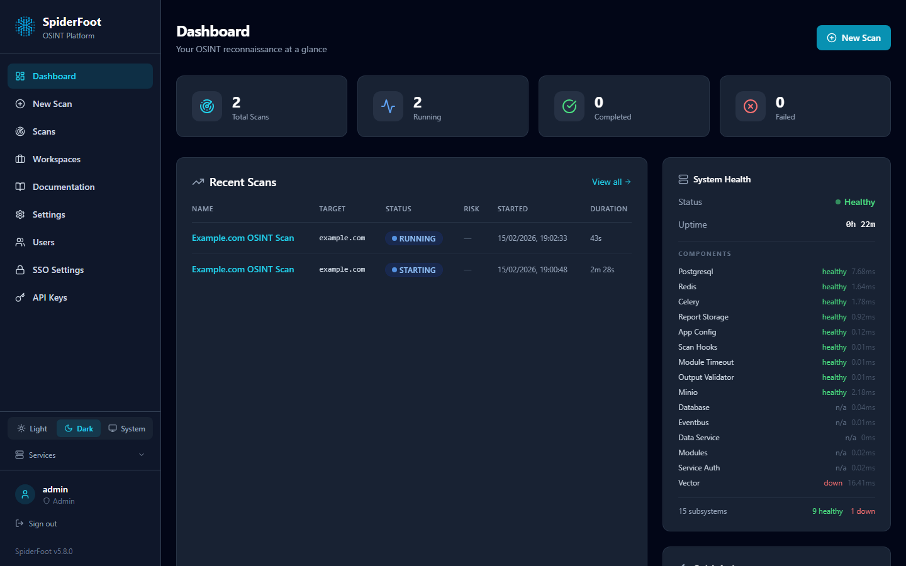
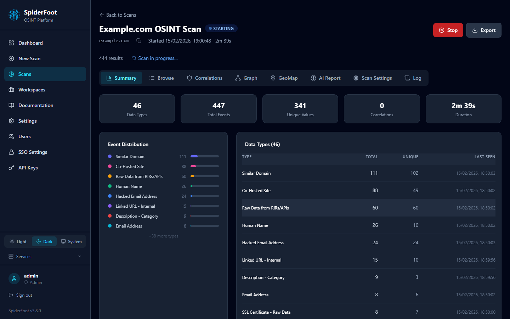

# SpiderFoot Wiki Index

Welcome to the SpiderFoot documentation! This wiki provides a structured, up-to-date, and webapp-aligned reference for users, developers, and administrators.

## Web UI Preview

SpiderFoot features a modern dark-themed React SPA with real-time scan updates, interactive graph visualization, geographic mapping, AI-generated CTI reports, and comprehensive scan management.

## Sections

| Section | Link |
|---|---|
| Overview | [Overview](overview.md) |
| Getting Started | [Getting Started](getting_started.md) |
| Installation Guide | [Installation Guide](installation.md) |
| Quick Start | [Quick Start](quickstart.md) |
| Configuration | [Configuration](configuration.md) |
| User Guide | [User Guide](user_guide.md) |
| Modules | [Modules](modules.md) |
| API Reference | [API Reference](api_reference.md) |
| Advanced Topics | [Advanced Topics](advanced.md) |
| Developer Guide | [Developer Guide](developer_guide.md) |
| FAQ | [FAQ](faq.md) |
| Troubleshooting | [Troubleshooting](troubleshooting.md) |
| Docker Deployment | [Docker Deployment](docker_deployment.md) |
| Architecture | [Architecture](ARCHITECTURE.md) |
| Correlations Engine | [Correlations](correlations/correlation.md) |
| Module Migration | [Module Migration Guide](MODULE_MIGRATION_GUIDE.md) |
| Security | [Security](security.md) |

---

For the most accurate and current information, always refer to this documentation as rendered in the webapp.
