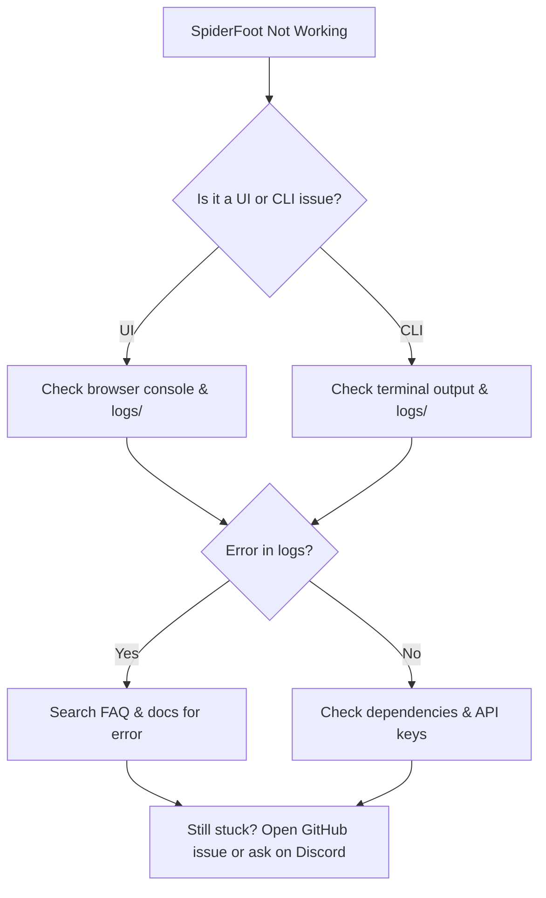

# FAQ

This FAQ addresses common questions, troubleshooting steps, and best practices for SpiderFoot users. If your question isn't answered here, check the full documentation or visit the community forums for more help.

---

## General Usage

**Q: How do I list all modules?**  
A: Run `python sf.py -M` from the command line to see all available modules.

**Q: How do I get help for a module?**  
A: Use `python sf.py -M <module>` to display help and usage information for a specific module.

**Q: Where do I configure API keys?**  
A: In the web UI, go to **Settings → Module Settings**. Each module that requires an API key will have a configuration field. See the [Configuration Guide](configuration.md) for more details.

**Q: How do I run a scan from the CLI?**  
A: Example:  
`python sf.py -s example.com -t DOMAIN_NAME -m sfp_dnsresolve,sfp_ssl`

**Q: Can I run SpiderFoot in Docker?**  
A: Yes! See the [Docker Deployment Guide](../docs/docker_deployment.md) for details. Docker is recommended for easy setup and isolation.

**Q: How do I update SpiderFoot?**  
A: Pull the latest code from GitHub and reinstall dependencies as needed. For Docker, pull the latest image and recreate your container.

**Q: Where are logs stored?**  
A: Logs are stored in the `logs/` directory by default. For Docker, use `docker logs <container>`.

**Q: How do I reset my admin password?**  
A: Stop SpiderFoot, delete the `spiderfoot.db` file, and restart. You will be prompted to create a new admin account.  
**Warning:** This deletes all data, including scan results and settings.

**Q: Where can I get more help?**  
A: Visit the [GitHub Issues page](https://github.com/poppopjmp/spiderfoot/issues) or join the [Discord community](https://discord.gg/vyvztrG).

---

## Troubleshooting

**Q: The web UI won't start or shows a blank page. What should I do?**  
A:  
- Check the logs in the `logs/` directory for errors.
- Ensure all dependencies are installed (`pip install -r requirements.txt`).
- If using Docker, check container logs with `docker logs <container>`.
- Try restarting the application.

**Q: My scan is stuck or not progressing.**  
A:  
- Check for errors in the logs.
- Ensure you have network connectivity.
- Some modules require API keys—verify they are set correctly.
- Try running a scan with fewer modules to isolate the issue.

**Q: I get "API key missing" or "quota exceeded" errors.**  
A:  
- Double-check your API key in **Settings → Module Settings**.
- Some APIs have usage limits; check your quota on the provider's dashboard.

**Q: How do I troubleshoot module errors?**  
A:  
- Review the scan log for error messages.
- Check the [Module Documentation](modules.md) for specific requirements.
- Update your API keys or try a different target.

**Q: How do I back up my data?**  
A:  
- Back up the `spiderfoot.db` file and the `logs/` directory.
- For Docker, use `docker cp` to copy files from the container.

---

## Advanced

**Q: Can I write my own modules?**  
A: Yes! See the [Developer Guide](developer_guide.md) for instructions and best practices.

**Q: How do I enable debug logging?**  
A:  
- Run with the `--debug` flag:  
  `python sf.py --debug`
- For Docker, set the environment variable `SF_DEBUG=1`.

**Q: How do I run SpiderFoot headless (no web UI)?**  
A:  
- Use the CLI:  
  `python sf.py -s <target> -t <type> -m <modules>`

**Q: Can I automate scans with scripts or CI/CD?**  
A:  
- Yes, use the CLI or the [API Reference](api_reference.md) for automation.

---

## Visual Troubleshooting Guide

---

Authored by poppopjmp  
_Last updated: June 2025_
