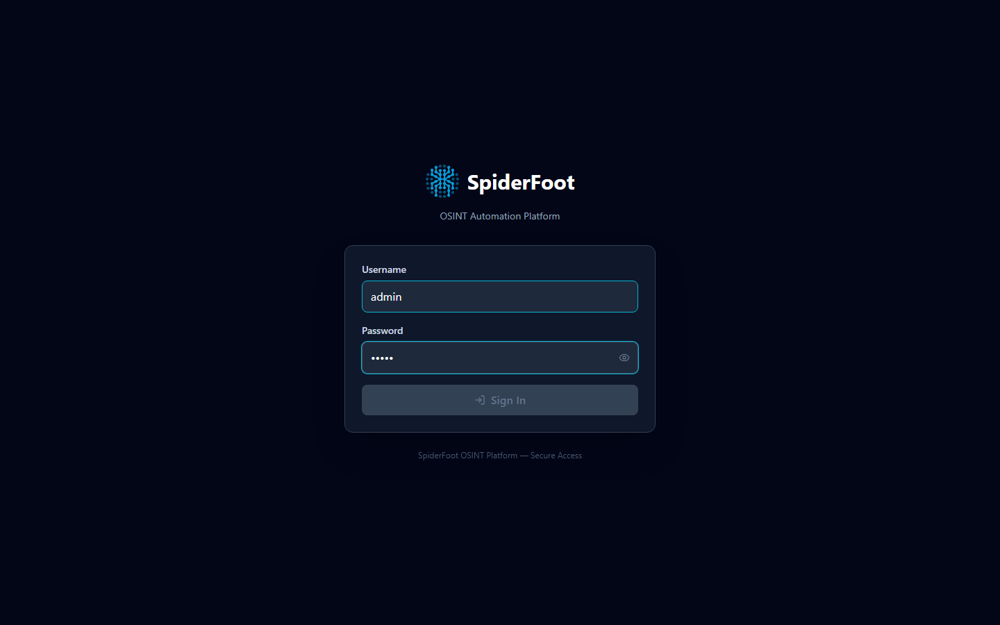
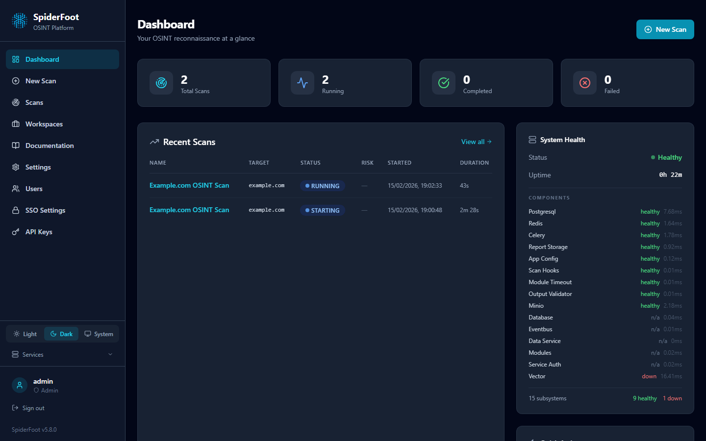
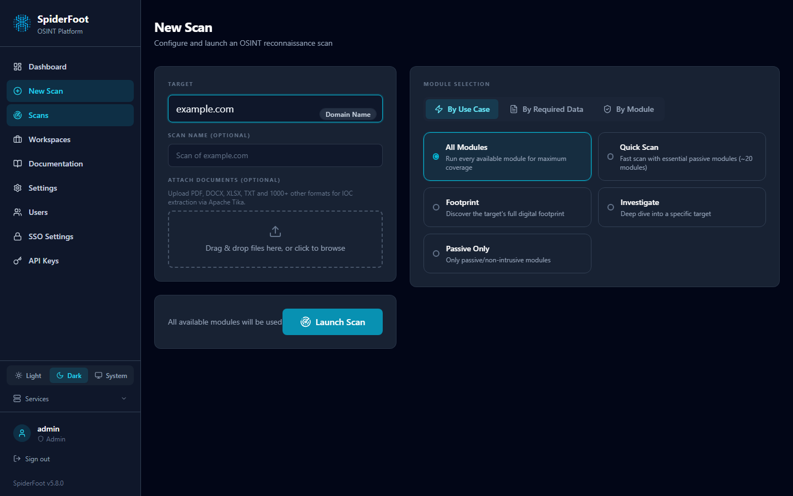
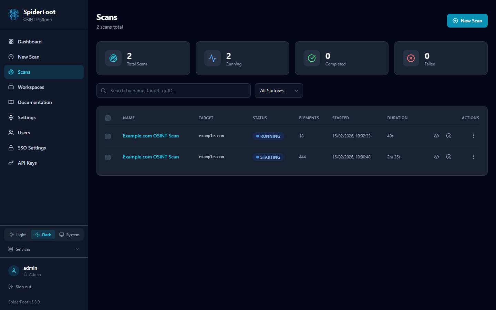
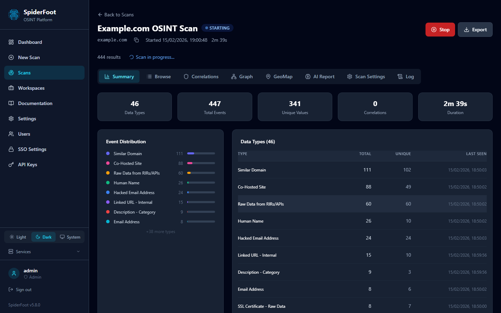
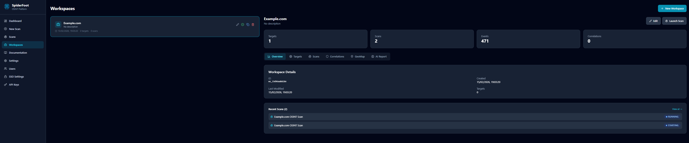

# Getting Started

*Author: poppopjmp*

Welcome to SpiderFoot! This guide will help you set up, configure, and run your first scan, whether you are a new user or an experienced security professional. Follow these steps to get SpiderFoot up and running quickly.

---

## 1. Installation

See the [Installation Guide](installation.md) for detailed steps. In summary:

- **Clone the repository:**
  ```bash
  git clone https://github.com/poppopjmp/spiderfoot.git
  cd spiderfoot
  ```

### Docker Compose (Recommended)

```bash
cp .env.example .env
# Edit .env — change passwords, uncomment profile sections as needed

# Core only (5 services)
docker compose -f docker-compose.yml up --build -d

# Or full stack (all services except SSO)
docker compose -f docker-compose.yml --profile full up --build -d
```

Access the UI at [http://localhost:3000](http://localhost:3000) (core) or [https://localhost](https://localhost) (with proxy profile).

### Standalone Mode

```bash
pip install -r requirements.txt
docker compose up -d
```

Access at [http://127.0.0.1:3000](http://127.0.0.1:3000).

## 2. Launching the Web Interface

Open your browser and navigate to the SpiderFoot URL. Log in with the default credentials (`admin` / `admin`) or your configured admin account.



The **Dashboard** provides at-a-glance statistics — active scans, total events, risk distribution, and recent scan activity.



## 3. Running Your First Scan

- Click **New Scan** from the sidebar or dashboard.
- Enter a target (e.g., `example.com`).
- Select the target type and choose module categories.
- Click **Run Scan**.



Results appear in real time. Click any scan to open the **Scan Detail** view with 8 tabs: Summary, Browse, Correlations, Graph, GeoMap, AI Report, Scan Settings, and Log.





## 4. Using the CLI

For a basic scan (the `name` field is required; the target type is auto-detected):
```sh
curl -X POST http://localhost:8001/api/scans \
  -H "Content-Type: application/json" \
  -d '{"name": "example.com recon", "target": "example.com", "modules": ["sfp_dnsresolve", "sfp_sslcert", "sfp_whois"]}'
```
- Use `curl -X GET http://localhost:8001/api/data/modules` to list all available modules.
- The cross-platform `spiderfoot-cli` (`scan start`, `scan list`, `modules list`, …) is also available — see [cli/README.md](../cli/README.md).

## 5. Workspaces and Multi-Target Scans

Organize related scans into **Workspaces** for multi-target campaigns, recurring assessments, or team collaboration. Each workspace groups scans, tracks notes, and provides workspace-level analytics and AI-generated reports.



## 6. Configuration

### Basic Configuration
- Configure API keys for modules in the web UI under **Settings → Module Settings**.
- Advanced options are set via `SF_*` environment variables (the `.env` file). See the [Configuration Guide](configuration.md).

### Security Configuration (Recommended)
For production deployments, configure security features:

```bash
# Set a strong JWT signing secret (used for access/refresh tokens)
export SF_JWT_SECRET=$(openssl rand -hex 32)

# Logging verbosity
export SF_LOG_LEVEL=INFO
```

These (and all other `SF_*` settings) are typically placed in the `.env` file —
see [`.env.example`](../.env.example) at the repository root. Security
configuration is validated automatically at startup
(`spiderfoot/security/startup_check.py`).

## Troubleshooting
- If you have issues, check the [Troubleshooting Guide](troubleshooting.md).
- Ensure all dependencies are installed and ports are open.
- For Docker, check container logs with `docker logs <container_id>`.
- For module errors, verify API keys and settings.

---

Continue to the [Quick Start](quickstart.md) or [User Guide](user_guide.md) for more advanced usage, tips, and best practices.

