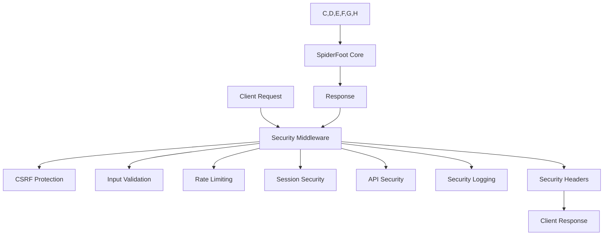

# SpiderFoot Security Guide

*Author: SpiderFoot Security Team*

SpiderFoot has been enhanced with enterprise-grade security features to provide comprehensive protection for web applications, APIs, and data handling. This guide covers all security measures, configuration, and best practices.

---

## Security Architecture

SpiderFoot's security implementation follows a layered approach with multiple protection mechanisms:



## Core Security Components

### 1. Security Middleware
**File:** `spiderfoot/security_middleware.py`

The unified security middleware integrates all security components and provides:

- **CherryPy/FastAPI Integration:** Seamless web and API protection
- **Request Processing:** CSRF, input validation, rate limiting
- **Response Security:** Security headers, content sanitization
- **Performance Monitoring:** Security operation metrics
- **Configuration Management:** Centralized security settings

**Key Features:**
- Automatic security header injection
- Request/response filtering
- Error handling and logging
- Performance optimization

### 2. CSRF Protection
**File:** `spiderfoot/csrf_protection.py`

Protects against Cross-Site Request Forgery attacks with:

- **Token Generation:** Cryptographically secure CSRF tokens
- **Token Validation:** Request authenticity verification
- **Session Integration:** Token lifecycle management
- **Ajax Support:** JSON and form-based request protection

**Configuration:**
```python
'security.csrf.enabled': True,
'security.csrf.secret_key': 'your-secret-key',
'security.csrf.timeout': 3600,  # Token expiry in seconds
```

### 3. Input Validation and Sanitization
**File:** `spiderfoot/input_validation.py`

Comprehensive input validation with static methods for:

- **Email Validation:** RFC-compliant email address checking
- **Domain Validation:** DNS-compatible domain name verification
- **URL Validation:** Proper URL format and protocol checking
- **IP Address Validation:** IPv4/IPv6 address verification
- **HTML Sanitization:** XSS prevention and content cleaning
- **SQL Injection Prevention:** Query parameter sanitization

**Available Methods:**
```python
InputValidator.validate_email(email)
InputValidator.validate_domain(domain)
InputValidator.validate_url(url)
InputValidator.validate_ip_address(ip)
InputValidator.sanitize_html(content)
InputValidator.sanitize_scan_input(target)
InputValidator.sanitize_api_key(key)
```

### 4. Rate Limiting
**File:** `spiderfoot/rate_limiting.py`

Advanced rate limiting with multiple storage backends:

- **Memory Storage:** Fast in-memory rate limiting
- **Redis Storage:** Distributed rate limiting
- **Sliding Window:** Precise rate calculation
- **Per-Endpoint Limits:** Granular control
- **API/Web Separation:** Different limits for different interfaces

**Configuration:**
```python
'security.rate_limiting.enabled': True,
'security.rate_limiting.storage': 'memory',  # or 'redis'
'security.rate_limiting.api_requests_per_minute': 60,
'security.rate_limiting.web_requests_per_minute': 120,
```

### 5. Session Management
**File:** `spiderfoot/session_security.py`

Secure session handling with:

- **Session Creation:** Secure token generation
- **Session Validation:** IP and user agent checking
- **Session Invalidation:** Proper cleanup and logout
- **Multi-Session Support:** User session limits
- **Storage Backends:** Memory and Redis support

**Methods:**
```python
session_manager.create_session(user_id, user_agent, ip_address)
session_manager.validate_session(token, user_agent, ip_address)
session_manager.invalidate_session(token)
```

### 6. API Security
**File:** `spiderfoot/api_security.py`

Comprehensive API protection including:

- **JWT Tokens:** Stateless authentication
- **API Keys:** Long-term API access
- **Scope Management:** Permission-based access control
- **Database Storage:** Persistent key management
- **Key Rotation:** Security best practices

**Classes:**
- `APISecurityManager`: JWT and scope management
- `APIKeyManager`: Database-backed key storage
- `APIRequestValidator`: Request validation
- `DDoSProtectionManager`: Attack mitigation

### 7. Security Logging
**File:** `spiderfoot/security_logging.py`

Structured security event logging with:

- **Event Types:** Predefined security event categories
- **Structured Logging:** JSON-formatted security events
- **Real-time Monitoring:** Immediate threat detection
- **Alert System:** Threshold-based alerting
- **Audit Trail:** Comprehensive security records

**Event Types:**
```python
SecurityEventType.LOGIN_SUCCESS
SecurityEventType.LOGIN_FAILURE
SecurityEventType.UNAUTHORIZED_ACCESS
SecurityEventType.RATE_LIMIT_EXCEEDED
SecurityEventType.SUSPICIOUS_ACTIVITY
SecurityEventType.XSS_ATTEMPT
SecurityEventType.SQL_INJECTION_ATTEMPT
```

### 8. Secure Configuration
**File:** `spiderfoot/secure_config.py`

Enhanced configuration management with:

- **Encryption:** AES-256 configuration encryption
- **Key Management:** Secure key storage and rotation
- **Backup/Restore:** Encrypted configuration backups
- **Compliance:** Security policy validation
- **Migration:** Secure configuration updates

## Security Headers

SpiderFoot automatically adds comprehensive security headers:

```http
Strict-Transport-Security: max-age=31536000; includeSubDomains
X-Content-Type-Options: nosniff
X-Frame-Options: DENY
X-XSS-Protection: 1; mode=block
Content-Security-Policy: default-src 'self'
Referrer-Policy: strict-origin-when-cross-origin
Permissions-Policy: geolocation=(), microphone=(), camera=()
```

## Configuration

### Basic Security Configuration

```python
# In your SpiderFoot configuration
security_config = {
    # CSRF Protection
    'security.csrf.enabled': True,
    'security.csrf.secret_key': 'your-strong-secret-key',
    'security.csrf.timeout': 3600,
    
    # Rate Limiting
    'security.rate_limiting.enabled': True,
    'security.rate_limiting.storage': 'memory',
    'security.rate_limiting.api_requests_per_minute': 60,
    'security.rate_limiting.web_requests_per_minute': 120,
    
    # Input Validation
    'security.input_validation.enabled': True,
    'security.input_validation.max_input_length': 10000,
    'security.input_validation.strict_mode': False,
    
    # Session Security
    'security.session_security.enabled': True,
    'security.session_security.storage': 'memory',
    'security.session_security.session_timeout': 3600,
    'security.session_security.max_sessions_per_user': 5,
    
    # API Security
    'security.api_security.enabled': True,
    'security.api_security.jwt_secret': 'your-jwt-secret',
    'security.api_security.jwt_expiry': 3600,
    'security.api_security.api_key_length': 32,
    
    # Security Logging
    'security.logging.enabled': True,
    'security.logging.log_file': 'security.log',
    'security.logging.log_level': 'INFO',
}
```

### Environment Variables

Set these environment variables for production:

```bash
SPIDERFOOT_CSRF_SECRET=your-csrf-secret-key
SPIDERFOOT_JWT_SECRET=your-jwt-secret-key
SPIDERFOOT_SECURITY_LOG_FILE=/var/log/spiderfoot/security.log
SPIDERFOOT_RATE_LIMIT_STORAGE=redis
SPIDERFOOT_REDIS_HOST=localhost
SPIDERFOOT_REDIS_PORT=6379
```

## Security Validation

SpiderFoot includes a comprehensive security validator:

```bash
cd spiderfoot
python security_validator.py /path/to/spiderfoot
```

**Validation Features:**
- Security module availability checks
- Functionality testing
- Performance impact assessment
- Configuration validation
- Integration testing

## Production Security Checklist

### Essential Security Measures

- [ ] **HTTPS Only:** Configure TLS/SSL certificates
- [ ] **Strong Secrets:** Use cryptographically secure secret keys
- [ ] **Rate Limiting:** Enable appropriate rate limits
- [ ] **Input Validation:** Enable strict validation mode
- [ ] **Session Security:** Configure secure session management
- [ ] **Security Logging:** Enable comprehensive logging
- [ ] **Regular Updates:** Keep SpiderFoot and dependencies updated

### Advanced Security

- [ ] **Redis Backend:** Use Redis for distributed rate limiting and sessions
- [ ] **Database Encryption:** Enable database encryption at rest
- [ ] **Firewall Rules:** Restrict network access to SpiderFoot
- [ ] **Reverse Proxy:** Use nginx/Apache with security headers
- [ ] **Monitoring:** Set up security event monitoring and alerting
- [ ] **Backup Security:** Encrypt configuration and data backups

### Compliance Considerations

- [ ] **Data Privacy:** Configure data retention and deletion policies
- [ ] **Access Control:** Implement role-based access control
- [ ] **Audit Logging:** Enable comprehensive audit trails
- [ ] **Incident Response:** Prepare security incident procedures
- [ ] **Regular Security Audits:** Schedule periodic security reviews

## Integration Examples

### Web UI Integration

The security middleware is automatically integrated into the SpiderFoot web UI:

```python
# In sfwebui.py
from spiderfoot.security_middleware import SpiderFootSecurityMiddleware

# Initialize security middleware
security_middleware = SpiderFootSecurityMiddleware(config)

# CherryPy integration is automatic
```

### API Integration

For FastAPI applications:

```python
# In api/main.py
from spiderfoot.security_middleware import SpiderFootSecurityMiddleware

app = FastAPI()
security_middleware = SpiderFootSecurityMiddleware(config)

# Middleware is automatically applied
```

### Custom Integration

For custom applications:

```python
from spiderfoot.security_middleware import SpiderFootSecurityMiddleware

# Initialize middleware
security = SpiderFootSecurityMiddleware(config)

# Process requests
def handle_request(request):
    # Apply security processing
    processed_request = security.process_request(request)
    
    # Your application logic here
    response = your_app_logic(processed_request)
    
    # Apply security headers
    secure_response = security.process_response(response)
    return secure_response
```

## Monitoring and Alerting

### Security Event Monitoring

Monitor these key security events:

- **Authentication Failures:** Failed login attempts
- **Rate Limit Violations:** Suspicious request patterns
- **Input Validation Failures:** Potential attack attempts
- **Session Anomalies:** Unusual session behavior
- **API Abuse:** Unauthorized API access attempts

### Log Analysis

Security logs are structured JSON for easy analysis:

```json
{
  "timestamp": "2025-07-08T10:00:00.000Z",
  "event_type": "rate_limit_exceeded",
  "severity": "WARNING",
  "ip_address": "192.168.1.100",
  "details": {
    "endpoint": "/api/scans",
    "limit_type": "api",
    "current_count": 65,
    "limit": 60
  }
}
```

## Troubleshooting

### Common Issues

**CSRF Token Errors:**
- Ensure proper secret key configuration
- Check token expiry settings
- Verify AJAX request headers

**Rate Limiting Issues:**
- Adjust rate limits for your use case
- Consider Redis for distributed setups
- Monitor rate limit violations

**Session Problems:**
- Check session timeout configuration
- Verify IP address validation settings
- Consider session storage backend

**API Security Issues:**
- Validate JWT secret configuration
- Check API key permissions
- Verify request signatures

### Debug Mode

Enable debug logging for troubleshooting:

```python
'security.logging.log_level': 'DEBUG'
```

### Performance Impact

Security middleware adds minimal overhead:
- **CSRF Protection:** < 5ms per request
- **Input Validation:** < 10ms per request
- **Rate Limiting:** < 2ms per request
- **Session Validation:** < 3ms per request

## Security Best Practices

### Development

- Use strong, unique secret keys for each environment
- Test security features in development environment
- Implement proper error handling for security failures
- Regular security code reviews

### Deployment

- Use HTTPS in production
- Enable all security features
- Configure appropriate rate limits
- Set up monitoring and alerting
- Regular security updates

### Operations

- Monitor security logs regularly
- Perform periodic security audits
- Update security configurations as needed
- Maintain incident response procedures

## Support and Resources

### Documentation

- [Configuration Guide](configuration.md)
- [API Documentation](api_reference.md)
- [Troubleshooting Guide](troubleshooting.md)
- [Developer Guide](developer_guide.md)

### Security Resources

- Security validation tool: `python security_validator.py`
- Integration guide: `SECURITY_INTEGRATION_GUIDE.md`
- Validation summary: `SECURITY_VALIDATION_SUMMARY.md`

### Getting Help

- GitHub Issues: Report security concerns
- Community Forums: Discuss security best practices
- Security Team: Contact for enterprise security support

---

**Note:** Security is an ongoing process. Regularly review and update your security configuration based on evolving threats and requirements.

Cross-Site Request Forgery protection for web forms and API endpoints.

**Features:**
- Token-based CSRF protection
- Session-specific tokens
- Automatic token validation
- Configurable token expiry

**Methods:**
- `generate_csrf_token()` - Generate new CSRF token
- `validate_csrf_token(token)` - Validate token
- `get_csrf_token_html()` - Get HTML input field

### 3. Input Validation (`input_validation.py`)

Comprehensive input sanitization and validation system.

**Features:**
- Email validation
- Domain validation
- URL validation
- HTML sanitization
- XSS prevention
- SQL injection prevention

**Static Methods:**
- `validate_email(email)` - Email format validation
- `validate_domain(domain)` - Domain name validation
- `validate_url(url)` - URL format validation
- `sanitize_html(content)` - HTML content sanitization
- `escape_html(content)` - HTML character escaping
- `sanitize_api_key(key)` - API key sanitization
- `sanitize_scan_input(target)` - Scan target validation
- `validate_file_upload(filename, content)` - File upload validation

### 4. Rate Limiting (`rate_limiting.py`)

Advanced rate limiting system for API and web endpoints.

**Features:**
- Redis and memory-based storage
- Multiple rate limit types (API, web, scan, login)
- Sliding window algorithm
- Per-client tracking
- Configurable limits

**Methods:**
- `check_rate_limit(limit_type)` - Check if request is allowed
- `is_rate_limited(limit_type)` - Simple rate limit check
- `get_rate_limit_info(limit_type)` - Get rate limit status

**Decorators:**
- `@api_rate_limit` - API endpoint rate limiting
- `@web_rate_limit` - Web endpoint rate limiting
- `@scan_rate_limit` - Scan operation rate limiting
- `@login_rate_limit` - Login attempt rate limiting

### 5. Session Security (`session_security.py`)

Secure session management with Redis and memory backend support.

**Features:**
- Secure session creation and validation
- Session fingerprinting (IP, User-Agent)
- Session timeout management
- Multiple session storage backends
- Session cleanup and management

**Methods:**
- `create_session(user_id, user_agent, ip_address)` - Create new session
- `validate_session(token, user_agent, ip_address)` - Validate session
- `invalidate_session(token)` - Invalidate specific session
- `invalidate_user_sessions(user_id)` - Invalidate all user sessions
- `cleanup_expired_sessions()` - Remove expired sessions

### 6. API Security (`api_security.py`)

Comprehensive API security including JWT tokens and API key management.

**Components:**

#### APISecurityManager
- JWT token generation and validation
- API key creation and management
- Permission-based access control
- Request signing and validation

**Methods:**
- `generate_api_key(user_id, scopes)` - Generate API key
- `validate_api_key(key)` - Validate API key
- `check_permission(claims, scope)` - Check access permissions
- `create_signature(method, url, payload)` - Create request signature

#### APIKeyManager (Database)
- Database-backed API key storage
- API key lifecycle management
- Usage tracking and analytics
- Rate limit enforcement

**Methods:**
- `create_api_key(user_id, scopes, name)` - Create and store API key
- `revoke_api_key(key_id, user_id)` - Revoke API key
- `list_user_api_keys(user_id)` - List user's API keys
- `update_last_used(key_hash)` - Update usage statistics

### 7. Security Logging (`security_logging.py`)

Comprehensive security event logging and monitoring system.

**Features:**
- Structured security event logging
- Security event types enumeration
- Automated threat detection
- Audit trail generation
- Integration with SIEM systems

**Security Event Types:**
- LOGIN_SUCCESS / LOGIN_FAILURE
- API_KEY_CREATED / API_KEY_REVOKED
- UNAUTHORIZED_ACCESS
- RATE_LIMIT_EXCEEDED
- SUSPICIOUS_ACTIVITY
- CSRF_VIOLATION
- XSS_ATTEMPT / SQL_INJECTION_ATTEMPT

**Methods:**
- `log_security_event(event_type, details, metadata)` - Log security event
- `log_login_attempt(username, success, ip_address)` - Log login attempts
- `log_unauthorized_access(endpoint, user_id, ip_address)` - Log unauthorized access
- `log_rate_limit_exceeded(endpoint, limit_type, ip_address)` - Log rate limit violations

### 8. Secure Configuration (`secure_config.py`)

Enhanced secure configuration management with encryption and key rotation.

**Features:**
- Configuration encryption/decryption
- Master key management
- Key rotation capabilities
- Secure backup and restore
- Compliance validation

**Methods:**
- `encrypt_value(value)` - Encrypt sensitive values
- `decrypt_value(encrypted_value)` - Decrypt values
- `encrypt_config(config_dict)` - Encrypt configuration
- `decrypt_config(encrypted_config)` - Decrypt configuration
- `rotate_master_key()` - Rotate encryption keys
- `backup_encrypted_config(filepath)` - Secure config backup
- `validate_compliance()` - Check compliance requirements

## Integration Points

### Web Interface Integration (`sfwebui.py`)

The security middleware is integrated into the web interface:

```python
# Security middleware initialization
if config.get('_security_enabled', True):
    security_middleware = SpiderFootSecurityMiddleware(config)
    app.security = security_middleware
```

### API Integration (`api/main.py`)

FastAPI security middleware integration:

```python
# Add security middleware
app.add_middleware(
    SpiderFootSecurityMiddleware,
    config=config
)
```

### Security Headers

Automatically applied security headers:
- `X-Content-Type-Options: nosniff`
- `X-Frame-Options: DENY`
- `X-XSS-Protection: 1; mode=block`
- `Strict-Transport-Security: max-age=31536000; includeSubDomains`
- `Content-Security-Policy: default-src 'self'`
- `Referrer-Policy: strict-origin-when-cross-origin`

## Configuration

### Basic Security Configuration

```python
# In SpiderFoot configuration
config = {
    # Security middleware
    '_security_enabled': True,
    
    # CSRF Protection
    'security.csrf.enabled': True,
    'security.csrf.secret_key': 'your-csrf-secret-key',
    'security.csrf.timeout': 3600,
    
    # Rate Limiting
    'security.rate_limiting.enabled': True,
    'security.rate_limiting.storage': 'redis',  # or 'memory'
    'security.rate_limiting.api_requests_per_minute': 60,
    'security.rate_limiting.web_requests_per_minute': 120,
    
    # Input Validation
    'security.input_validation.enabled': True,
    'security.input_validation.max_input_length': 10000,
    'security.input_validation.strict_mode': False,
    
    # Session Security
    'security.session_security.enabled': True,
    'security.session_security.storage': 'redis',  # or 'memory'
    'security.session_security.session_timeout': 3600,
    'security.session_security.max_sessions_per_user': 5,
    
    # API Security
    'security.api_security.enabled': True,
    'security.api_security.jwt_secret': 'your-jwt-secret-key',
    'security.api_security.jwt_expiry': 3600,
    'security.api_security.api_key_length': 32,
    
    # Security Logging
    'security.logging.enabled': True,
    'security.logging.log_file': 'security.log',
    'security.logging.log_level': 'INFO',
    
    # Security Headers
    'security.headers.enabled': True
}
```

### Production Configuration

For production deployments, ensure:

1. **Strong Secret Keys**: Use cryptographically secure random keys
2. **Redis Configuration**: Use Redis for session and rate limiting storage
3. **HTTPS Only**: Enable HTTPS and HSTS headers
4. **Audit Logging**: Enable comprehensive security logging
5. **Regular Key Rotation**: Implement automated key rotation

## Security Validation

### Validation Tool

Use the security validator to test all security components:

```bash
cd spiderfoot/spiderfoot
python security_validator.py /path/to/spiderfoot
```

### Validation Results

The validator tests:
- ✅ Secure Configuration Management
- ✅ CSRF Protection (requires Flask context)
- ✅ Input Validation
- ✅ Rate Limiting (requires Flask context)
- ✅ Session Security
- ✅ API Security
- ✅ Security Logging
- ✅ Security Middleware Integration

## Security Best Practices

### Development
1. Always validate user input
2. Use CSRF tokens for state-changing operations
3. Implement proper rate limiting
4. Log security events
5. Follow secure coding practices

### Deployment
1. Use HTTPS in production
2. Configure secure headers
3. Enable security logging
4. Monitor for security events
5. Regular security updates

### Operations
1. Monitor security logs
2. Implement alerting for security events
3. Regular security audits
4. Key rotation procedures
5. Incident response planning

## Migration Guide

For existing installations, see the [Security Integration Guide](SECURITY_INTEGRATION_GUIDE.md) for detailed migration steps.

## Performance Impact

Security middleware adds minimal overhead:
- Input validation: ~1-5ms per request
- CSRF protection: ~0.5ms per request
- Rate limiting: ~1-2ms per request
- Session validation: ~2-3ms per request
- Security logging: ~0.5-1ms per request

Total overhead: ~5-12ms per request (negligible for most use cases)

## Troubleshooting

### Common Issues

1. **CSRF Token Validation Fails**
   - Ensure CSRF is enabled in configuration
   - Check that forms include CSRF tokens
   - Verify secret key configuration

2. **Rate Limiting Too Restrictive**
   - Adjust rate limits in configuration
   - Check Redis connectivity
   - Monitor rate limit logs

3. **Session Validation Fails**
   - Check session timeout settings
   - Verify Redis/memory backend
   - Check IP/User-Agent fingerprinting

4. **API Authentication Issues**
   - Verify API key configuration
   - Check JWT secret key
   - Review API security logs

### Debug Mode

Enable debug logging for security components:

```python
logging.getLogger('spiderfoot.security').setLevel(logging.DEBUG)
```

## Support

For security-related issues:
1. Check the troubleshooting section
2. Review security logs
3. Use the validation tool
4. Consult the integration guide
