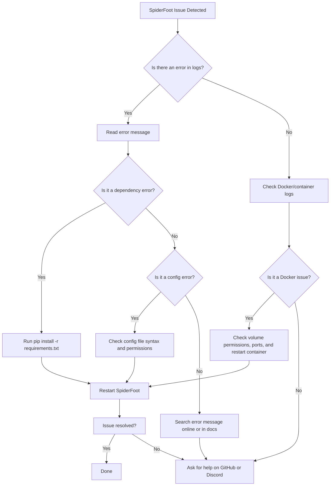
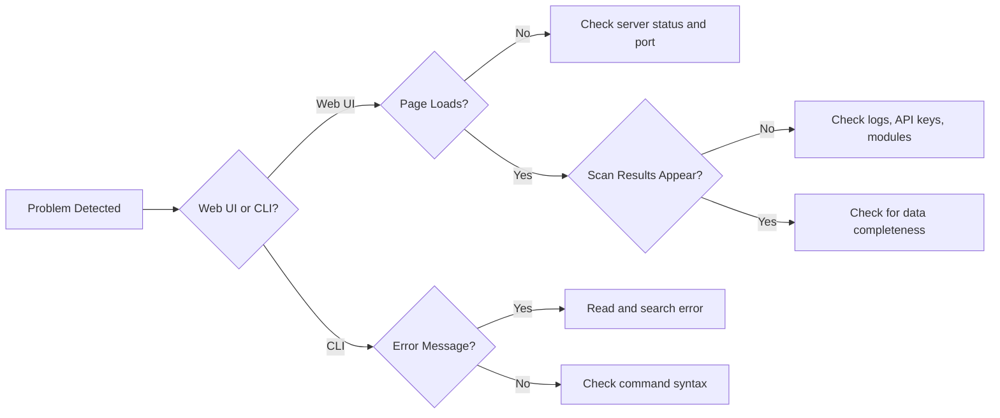
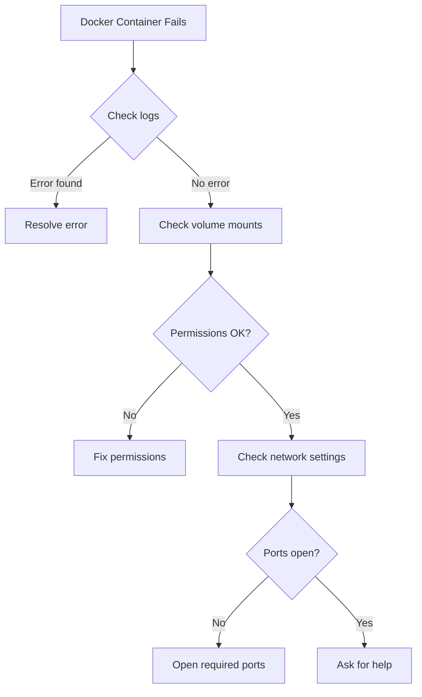
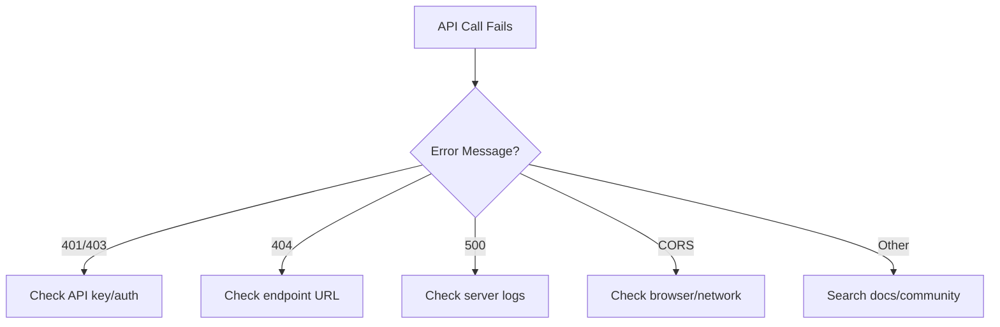
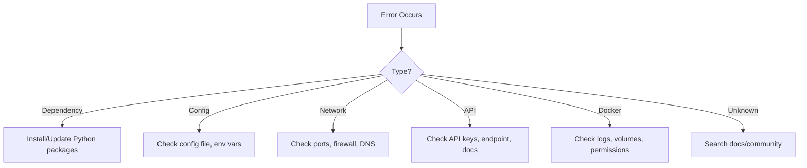
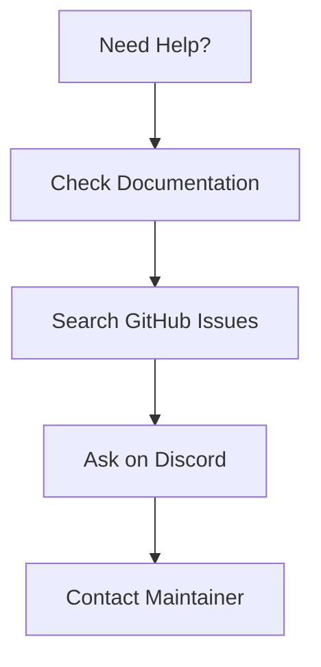

# Troubleshooting

If you encounter issues with SpiderFoot, use this guide to diagnose and resolve common problems. For additional help, consult the documentation, GitHub Issues, or the Discord community.

---

## General Troubleshooting Steps

- **Check logs:** Review logs in the `logs/` directory for error messages and stack traces.
- **Verify dependencies:** Ensure all required Python packages are installed. Use `pip install -r requirements.txt` to install missing dependencies.
- **Restart the application:** Sometimes, simply restarting SpiderFoot or your Docker container resolves transient issues.
- **Check for updates:** Make sure you are running the latest version of SpiderFoot and its dependencies.

---

## Troubleshooting Workflow Diagram

Below is a simple troubleshooting workflow for SpiderFoot. Follow the arrows to diagnose and resolve issues efficiently.

---

## Troubleshooting Decision Tree

---

## Docker Troubleshooting Flow

---

## API Troubleshooting Flow

---

## Visual: Common Error Types

---

## Visual: Support Channels

---

## Common Error Messages

| Error Message                        | Likely Cause                        | Solution                                 |
|--------------------------------------|-------------------------------------|------------------------------------------|
| `ModuleNotFoundError`                | Missing Python dependency           | Run `pip install -r requirements.txt`    |
| `Address already in use`             | Port conflict                       | Change port in config or command         |
| `Permission denied`                  | File or directory permissions       | Check file permissions, run as admin     |
| `API key not set`                    | Missing API key for a module        | Set API key in web UI                    |
| `Database locked`                    | SQLite concurrency issue            | Restart SpiderFoot, avoid multiple runs  |

---

## Getting More Help

If you can't resolve your issue, visit the [GitHub Issues page](https://github.com/poppopjmp/spiderfoot/issues) or join the Discord community for support. Please provide detailed information about your environment and the problem (OS, Python version, Docker version, error messages, steps to reproduce, etc.).

---

## Wiki & Further Reading

- [Official Documentation](https://github.com/poppopjmp/spiderfoot/wiki)
- [User Guide](user_guide.md)
- [API Reference](api_reference.md)
- [Modules Index](modules.md)
- [Developer Guide](developer_guide.md)
- [Advanced Topics](advanced.md)

---

## Module Reference

A full, detailed description for each module is available in the `documentation/modules/` folder. Each file describes the module's purpose, usage, required API keys, and example output.

---

Authored by poppopjmp
